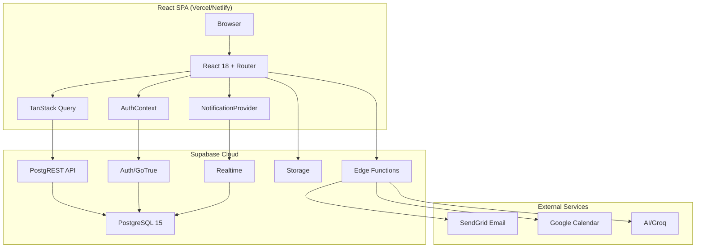
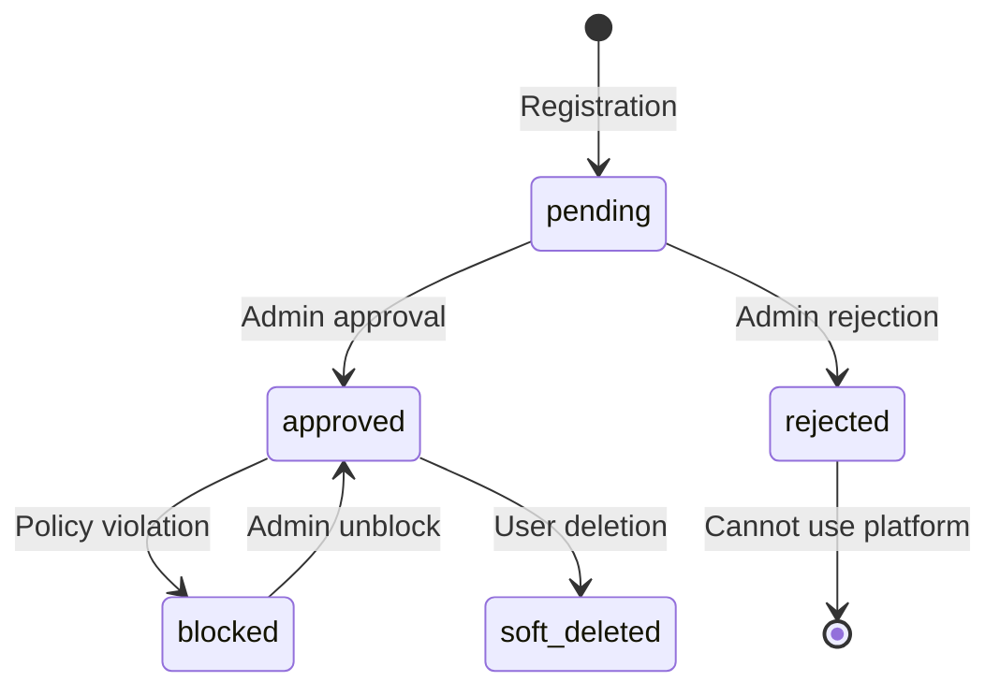

# Forgecircle Alumni Platform — Complete Atomic Decomposition

> **Application Archaeologist & System Cartographer Report**  
> **Generated:** May 1, 2026  
> **Project:** Alumni-Standalone (Supabase Project: `sjksibkuxvduuuvakwqx`)

---

## 1. EXECUTIVE SUMMARY

The **Forgecircle Alumni Platform** is a comprehensive alumni networking and career development application built as a **React SPA** with **Supabase** as the backend-as-a-service. The platform serves multiple personas (Alumni, Students, Employers, Admins) through role-based access control, providing features for professional networking, job postings, mentorship, events, and community groups.

**Core Tech Stack:**
- **Frontend:** React 18 + TypeScript (partial), React Router 6, TanStack Query 4, TailwindCSS, MUI
- **Backend:** Supabase (PostgreSQL 15, Auth, Realtime, Storage, Edge Functions)
- **State Management:** React Context (Auth), TanStack Query (server state), localStorage (form recovery)
- **Real-time:** Supabase Realtime subscriptions for notifications, DMs, connections
- **File Storage:** Supabase Storage (resumes, avatars, event media)
- **Email/SMS:** SendGrid SMTP, Supabase Auth

**Scale Indicators:**
- 40+ database tables
- 150+ React components
- 200+ database functions
- 100+ RLS policies
- 6 user roles with granular permissions

---

## 2. ARCHITECTURE OVERVIEW

### 2.1 High-Level Architecture Diagram



### 2.2 Directory Structure

```
/Users/ashwin/Desktop/AI Projects/Alumni Standalone/
├── frontend/                     # React SPA
│   ├── src/
│   │   ├── api/                 # API layer (12 files)
│   │   ├── components/          # React components (251 files)
│   │   │   ├── Admin/           # Admin tools (33)
│   │   │   ├── Auth/            # Authentication (22)
│   │   │   ├── Dashboard/       # Dashboard widgets (5)
│   │   │   ├── Directory/       # Alumni directory (14)
│   │   │   ├── Events/          # Events module (20)
│   │   │   ├── Groups/          # Groups module (4)
│   │   │   ├── Jobs/            # Jobs module (28)
│   │   │   ├── Mentorship/      # Mentorship (37)
│   │   │   ├── Messages/        # DM system (12)
│   │   │   ├── Notifications/   # Notifications (12)
│   │   │   ├── Layout/          # Navigation, Header (3)
│   │   │   └── common/          # Shared UI (16)
│   │   ├── contexts/            # React Contexts (2)
│   │   ├── hooks/               # Custom hooks (44)
│   │   ├── pages/               # Route pages (21)
│   │   ├── services/            # Business logic (13)
│   │   ├── utils/               # Utilities (68)
│   │   └── constants/           # App constants (5)
│   └── package.json
├── supabase/
│   ├── config.toml              # Supabase configuration
│   ├── functions/               # Edge Functions (9)
│   │   ├── admin-invite-user/
│   │   ├── send-smtp-email/
│   │   ├── send-weekly-digest/
│   │   ├── process-job-alerts-ai/
│   │   ├── google-calendar-integration/
│   │   └── ...
│   └── migrations/              # DB migrations (50+ files)
├── docs/                        # Documentation (23 files)
├── scripts/                     # Utility scripts
└── schema.sql                   # Full schema dump (1.3MB)
```

### 2.3 Build & Deployment Configuration

| Aspect | Configuration |
|--------|---------------|
| **Frontend Build** | `react-scripts build` → static files |
| **Deployment** | Vercel (primary), Netlify (backup) |
| **CI/CD** | GitHub Actions (rbac-guard.yml) |
| **Environment** | `.env.local` for secrets, `.env` for defaults |
| **Database Migrations** | `supabase db push` |
| **Edge Functions** | `supabase functions deploy` |

---

## 3. DATABASE LAYER (SUPABASE)

### 3.1 Schema Inventory

#### Core Tables (40+ tables)

| Table | Purpose | Row Count Est. |
|-------|---------|----------------|
| `profiles` | User identity & core profile data | 10K+ |
| `jobs` | Job postings | 1K+ |
| `job_applications` | Application tracking | 5K+ |
| `events` | Event listings | 500+ |
| `event_attendees` | RSVP management | 5K+ |
| `groups` | Community groups | 200+ |
| `group_members` | Membership records | 2K+ |
| `mentors` | Mentor registry | 500+ |
| `mentorship_relationships` | Active mentorships | 1K+ |
| `connections` | User connections graph | 10K+ |
| `dm_threads` | Message threads | 5K+ |
| `dm_messages` | Direct messages | 50K+ |
| `notifications` | In-app notifications | 100K+ |
| `achievements` | Professional achievements | 2K+ |
| `user_resumes` | Resume metadata | 5K+ |

#### Auth Tables (managed by Supabase)

| Table | Purpose |
|-------|---------|
| `auth.users` | Supabase Auth user records |
| `auth.identities` | OAuth/linking identities |
| `auth.sessions` | Active sessions |
| `auth.refresh_tokens` | Token rotation |

#### Audit & System Tables

| Table | Purpose |
|-------|---------|
| `activity_logs` | User action audit trail |
| `admin_actions` | Admin operation logs |
| `admin_audit_log` | Detailed admin audit |
| `notification_audit_log` | Notification delivery tracking |
| `profile_approval_audit` | Profile approval history |

### 3.2 Custom Types (ENUMs)

```sql
-- Core Application Roles
CREATE TYPE "public"."app_role_enum" AS ENUM (
    'alumni', 'employer', 'admin', 'super_admin', 'student', 'mentor'
);

-- Job Status Workflow
CREATE TYPE "public"."job_status_enum" AS ENUM (
    'draft', 'pending_approval', 'active', 'paused', 'closed', 'rejected'
);

-- Mentorship Request States
CREATE TYPE "public"."mentorship_request_status" AS ENUM (
    'pending', 'accepted', 'rejected', 'cancelled_by_user', 'cancelled_by_system'
);

-- Group Visibility
CREATE TYPE "public"."group_visibility_enum" AS ENUM (
    'public', 'private'
);

-- Group Member Roles
CREATE TYPE "public"."group_member_role_enum" AS ENUM (
    'owner', 'admin', 'member'
);

-- Employment Types
CREATE TYPE "public"."employment_type" AS ENUM (
    'full-time', 'part-time', 'contract', 'internship'
);

-- Education Levels
CREATE TYPE "public"."job_education_level" AS ENUM (
    'diploma', 'bachelors', 'masters', 'phd', 'other'
);

-- Notification Modules
CREATE TYPE "public"."notification_module" AS ENUM (
    'connections', 'messages', 'jobs', 'mentorship', 'events', 'groups', 'system'
);

-- Activity Categories
CREATE TYPE "public"."activity_category" AS ENUM (
    'browse', 'create', 'update', 'delete', 'relationship', 'permission', 'auth', 'system'
);
```

### 3.3 RLS Policy Summary (100+ Policies)

#### Policy Categories

| Category | Count | Description |
|----------|-------|-------------|
| **Owner-based** | 40+ | `profile_id = auth.uid()` patterns |
| **Admin override** | 25+ | Admin/super_admin can view all |
| **Role-based** | 20+ | Specific role permissions |
| **Connection-based** | 10+ | Connected users can view |
| **Public read** | 15+ | Anyone can view (approved content) |
| **Tenant-scoped** | 5+ | Institution-level isolation |

#### Critical Policies

```sql
-- Profiles: Users can only see approved, non-deleted profiles
CREATE POLICY "Directory view approved only" ON "public"."profiles"
  FOR SELECT USING (
    ("status" = 'approved'::"public"."membership_status_enum") AND 
    (COALESCE("is_deleted", false) = false)
  );

-- Jobs: Employers see own, others see active/approved
CREATE POLICY "Employers can manage own jobs" ON "public"."jobs"
  FOR ALL USING (
    ("posted_by" = (SELECT "auth"."uid"() AS "uid")) OR
    (EXISTS (SELECT 1 FROM "public"."profiles" 
      WHERE ("profiles"."id" = (SELECT "auth"."uid"() AS "uid")) 
      AND "profiles"."role" = ANY (ARRAY['admin'::"public"."app_role_enum", 'super_admin'::"public"."app_role_enum"]))
    )
  );

-- Mentorship: Approved mentors only
CREATE POLICY "Anyone can view approved mentors" ON "public"."mentors"
  FOR SELECT USING (("status" = 'approved'::"text") OR ("user_id" = (SELECT "auth"."uid"() AS "uid")));

-- Groups: Privacy-respecting access
CREATE POLICY "Group members can view private groups" ON "public"."groups"
  FOR SELECT USING (
    ("visibility" = 'public'::"public"."group_visibility_enum") OR
    (EXISTS (SELECT 1 FROM "public"."group_members" 
      WHERE ("group_members"."group_id" = "groups"."id") 
      AND ("group_members"."user_id" = (SELECT "auth"."uid"() AS "uid"))))
  );
```

### 3.4 Database Functions (200+ Functions)

#### Key Function Categories

| Category | Examples |
|----------|----------|
| **Auth/Security** | `is_site_admin()`, `get_my_role()`, `has_permission()` |
| **Admin Operations** | `admin_block_user()`, `admin_delete_user_rpc()`, `admin_update_user_role()` |
| **Job Management** | `job_apply()`, `admin_delete_job()`, `search_jobs_with_education()` |
| **Mentorship** | `request_mentorship()`, `accept_mentorship_request()`, `end_mentorship()` |
| **Groups** | `accept_group_invite()`, `join_group()`, `leave_group()` |
| **Notifications** | `create_notification_once()`, `mark_notification_read()` |
| **Connections** | `request_connection()`, `accept_connection()`, `remove_connection()` |
| **Messaging** | `send_dm_message()`, `create_dm_thread()`, `get_thread_messages()` |
| **Analytics** | `log_activity()`, `get_recent_activity_for_user_role()` |

#### Security-Definer Functions (Critical)

```sql
-- Admin-only user deletion with cascade
CREATE OR REPLACE FUNCTION "public"."admin_delete_user_rpc"("target" "uuid")
RETURNS "jsonb" 
LANGUAGE "plpgsql" SECURITY DEFINER
SET "search_path" TO 'public', 'net', 'vault', 'extensions'
AS $$
DECLARE
  caller_role text;
  caller_institution uuid;
  target_institution uuid;
  target_role text;
  rows_count int;
BEGIN
  -- Security checks: admin validation, tenant boundary enforcement
  -- Soft-delete profile, anonymize auth record, log audit trail
END;
$$;
```

### 3.5 Triggers (Auto-Executing Logic)

| Trigger | Table | Purpose |
|---------|-------|---------|
| `add_creator_to_group_members` | `groups` | Auto-add group creator as owner |
| `_touch_updated_at` | Multiple | Auto-update `updated_at` timestamp |
| `_ja_fill_resume_path` | `job_applications` | Auto-populate resume path |
| `sync_profile_role_claim` | `profiles` | Sync role to JWT claims |
| `validate_jwt_role_claim` | `auth.users` | Validate role on auth changes |
| `block_direct_role_updates` | `profiles` | Prevent unauthorized role changes |

---

## 4. ROLE-BASED ACCESS CONTROL (RBAC)

### 4.1 Role Hierarchy

```
super_admin (platform-wide)
    └── admin (institution-level)
        ├── moderator (content)
        └── user management
    
alumni (primary persona)
    └── mentor (specialization)
    
student (limited access)

employer (recruiter focus)
```

### 4.2 Permission Matrix (Role × Feature × Action)

| Feature | alumni | student | employer | admin | super_admin |
|---------|--------|---------|----------|-------|-------------|
| **Dashboard** | ✅ R | ✅ R | ✅ R | ✅ R | ✅ R |
| **Directory View** | ✅ R | ❌ | ❌ | ✅ R | ✅ R |
| **Directory Search** | ✅ R | ❌ | ❌ | ✅ R/W | ✅ R/W |
| **Jobs Browse** | ✅ R | ✅ R | ✅ R | ✅ R/W | ✅ R/W |
| **Jobs Post** | ❌ | ❌ | ✅ C | ✅ C | ✅ C |
| **Jobs Apply** | ✅ C | ✅ C | ❌ | ✅ C | ✅ C |
| **Events RSVP** | ✅ C | ✅ C | ✅ C | ✅ R/W | ✅ R/W |
| **Events Create** | ❌ | ❌ | ❌ | ✅ C | ✅ C |
| **Mentorship Request** | ✅ C | ✅ C | ❌ | ✅ C | ✅ C |
| **Mentorship Give** | ✅ C | ❌ | ❌ | ✅ C | ✅ C |
| **Groups Join** | ✅ C | ✅ C | ❌ | ✅ R/W | ✅ R/W |
| **Groups Create** | ✅ C | ❌ | ❌ | ✅ C | ✅ C |
| **Messaging** | ✅ C (connected) | ✅ C (connected) | ✅ C (connected) | ✅ C | ✅ C |
| **Admin Panel** | ❌ | ❌ | ❌ | ✅ R/W | ✅ R/W |
| **User Management** | ❌ | ❌ | ❌ | ✅ R/W | ✅ R/W |
| **Analytics** | ❌ | ❌ | ❌ | ✅ R | ✅ R |

**Legend:** ✅ = Allowed, ❌ = Denied, R = Read, C = Create/Update, W = Write/Delete

### 4.3 Permission Constants (Frontend)

```javascript
// constants/roles.js
export const ROLES = {
  ALUMNI: 'alumni',
  STUDENT: 'student',
  EMPLOYER: 'employer',
  ADMIN: 'admin',
  SUPER_ADMIN: 'super_admin',
  MENTOR: 'mentor'
};

// Permission strings used in ProtectedRoute
export const PERMISSIONS = {
  ACCESS_DASHBOARD: 'access:dashboard',
  VIEW_JOBS: 'view:jobs',
  APPLY_JOBS: 'apply:jobs',
  POST_JOBS: 'post:jobs',
  VIEW_ALUMNI_DIRECTORY: 'view:alumni_directory',
  REQUEST_MENTORSHIP: 'request:mentorship',
  BECOME_MENTOR: 'become:mentor',
  ACCESS_GROUPS: 'access:groups',
  MESSAGE_USERS: 'message:users',
  ACCESS_ADMIN: 'access:admin',
  MANAGE_USERS: 'manage:users'
};

// Base permissions per role
const BASE_PERMISSIONS = {
  alumni: [
    'access:dashboard', 'view:jobs', 'apply:jobs', 'access:events',
    'view:alumni_directory', 'request:mentorship', 'become:mentor',
    'access:groups', 'message:users', 'access:profile_settings',
    'manage:mentor_profile', 'manage:mentee_requests'
  ],
  student: [
    'access:dashboard', 'view:jobs', 'apply:jobs', 'access:events',
    'request:mentorship', 'message:users'
  ],
  employer: [
    'access:dashboard', 'view:jobs', 'post:jobs', 'manage:jobs',
    'view:job_applications', 'manage:company_profile', 'access:events',
    'message:users'
  ],
  admin: [
    'access:dashboard', 'access:admin', 'manage:users', 'manage:jobs',
    'manage:events', 'manage:groups', 'view:analytics', 'manage:content'
  ],
  super_admin: ['*'] // All permissions
};
```

### 4.4 Approval State Machine



---

## 5. FRONTEND ARCHITECTURE

### 5.1 Routing Structure

| Route | Component | Permission Required | Guards |
|-------|-----------|---------------------|--------|
| `/` | `HomePage` | None | - |
| `/login` | `Login` | None | Redirect if authenticated |
| `/register` | `EnhancedRegister` | None | - |
| `/dashboard` | `AlumniDashboard` | `access:dashboard` | `RequireCompleteProfile` |
| `/directory` | `DirectoryPage` | `view:alumni_directory` | `RequireCompleteProfile` |
| `/directory/:id` | `AlumniProfile` | `view:alumni_directory` | - |
| `/jobs` | `JobListingsPage` | `view:jobs` | `RequireCompleteProfile` |
| `/jobs/:id` | `JobDetails` | `view:jobs` | - |
| `/jobs/post` | `PostJob` | `post:jobs` | `RequireCompleteProfile` |
| `/events` | `EventsPage` | `access:events` | `RequireCompleteProfile` |
| `/events/:id` | `EventDetail` | `access:events` | - |
| `/mentorship` | `MentorshipLayout` | `request:mentorship` | `RequireCompleteProfile` |
| `/groups` | `GroupsPage` | `access:groups` | `RequireCompleteProfile`, Non-employer |
| `/groups/:id` | `GroupManage` | Group membership | `RequireGroupAdmin` (for manage) |
| `/messages` | `Messages` | `message:users` | `RequireCompleteProfile`, Connected |
| `/profile` | `Profile` | Authenticated | - |
| `/profile/security` | `Security` | Authenticated | - |
| `/admin/*` | `AdminGate` | `access:admin` | Admin role check |
| `/notifications` | `NotificationsPage` | Authenticated | - |

### 5.2 Component Hierarchy

```
App.js (Root)
├── AuthProvider
│   ├── AuthContext (user, profile, role, permissions)
│   └── AuthListener (Supabase auth events)
├── QueryClientProvider
│   └── React Query cache
├── RealtimeProvider
│   └── Supabase realtime subscriptions
├── NotificationProvider
│   └── In-app notification state
└── AppContent
    ├── Navigation (Sidebar)
    ├── Header (User menu, notifications)
    └── Routes
        ├── ProtectedRoute (permission guard)
        │   └── RequireCompleteProfile
        │       └── Page Component
        └── PublicRoute
```

### 5.3 State Management Architecture

| State Type | Solution | Persistence |
|------------|----------|-------------|
| **Auth State** | AuthContext + Supabase | SessionStorage + localStorage (partial) |
| **Server State** | TanStack Query | In-memory cache (5min stale) |
| **UI State** | React useState/useReducer | None (ephemeral) |
| **Form State** | localStorage | localStorage (recovery) |
| **Navigation State** | React Router URL | URL |
| **Notification State** | NotificationContext | Supabase DB |

### 5.4 Custom Hooks Inventory (44 hooks)

#### Data Fetching Hooks

| Hook | Purpose | Dependencies |
|------|---------|--------------|
| `useMyProfile` | Current user's profile | `supabase` |
| `useProfileById` | Any profile by ID | `supabase` |
| `useDirectorySecure` | Directory search (RPC) | `supabase` |
| `useJobs` | Job listings with filters | `supabase` |
| `useMentors` | Mentor directory | `supabase` |
| `useGroups` | Group listings | `supabase` |
| `useEvents` | Event listings | `supabase` |
| `useConnections` | User connections | `supabase` |
| `useNotifications` | User notifications | `supabase`, `useRealtime` |
| `useDmMessages` | DM thread messages | `supabase`, `useDmRealtime` |

#### Real-time Hooks

| Hook | Purpose |
|------|---------|
| `useDmRealtime` | Subscribe to DM updates |
| `useNotificationsRealtime` | Subscribe to notification changes |
| `useConnectionsRealtime` | Subscribe to connection changes |
| `useJobsRealtime` | Subscribe to job updates |

#### Approval & Permission Hooks

| Hook | Purpose |
|------|---------|
| `useApproval` | Profile approval state |
| `useMentorshipEligibility` | Mentorship permission checks |
| `useSecurityQuestion` | Security question management |

### 5.5 Design System

| Element | Implementation |
|---------|----------------|
| **CSS Framework** | TailwindCSS 3.3 |
| **Component Library** | MUI 5.14 + Custom |
| **Icons** | Heroicons React 2.0 |
| **Typography** | System fonts + Inter |
| **Color Palette** | Primary: Navy (#1e3a5f), Accent: Gold (#c9a227) |
| **Spacing** | Tailwind scale (4px base) |
| **Responsive** | Mobile-first (sm, md, lg, xl) |
| **Dark Mode** | ❌ Not implemented |

---

## 6. API LAYER

### 6.1 API Structure

| API Module | File | Endpoints |
|------------|------|-----------|
| **Admin API** | `api/admin.js` | User management, analytics |
| **Jobs API** | `api/jobs.js` | CRUD, applications, bookmarks |
| **Groups API** | `api/groups.js` | CRUD, memberships, invites |
| **Mentorship API** | `api/mentorshipApi.js` | Requests, relationships |
| **Notifications API** | `api/notifications.js` | CRUD, preferences |
| **Direct Messages API** | `api/dm.js` | Threads, messages |
| **Comments API** | `api/comments.js` | Group post comments |

### 6.2 Key RPC Functions (Supabase)

| RPC Name | Purpose | Security |
|----------|---------|----------|
| `job_apply` | Submit job application | Owner + approved only |
| `search_jobs_with_education` | Match jobs to education | Authenticated |
| `request_mentorship` | Create mentorship request | Approved users |
| `accept_mentorship_request` | Approve request | Mentor only |
| `send_dm_message` | Send direct message | Connected users |
| `request_connection` | Send connection request | Approved users |
| `accept_connection` | Accept connection request | Recipient only |
| `join_group` | Join public group | Approved users |
| `accept_group_invite` | Accept group invitation | Invited user |
| `create_group` | Create new group | Alumni only |
| `admin_block_user` | Block user account | Admin only |
| `admin_delete_user_rpc` | Soft-delete user | Admin only |

### 6.3 Edge Functions

| Function | Trigger | Purpose |
|----------|---------|---------|
| `admin-invite-user` | HTTP | Send admin invitations |
| `send-smtp-email` | HTTP/DB | Send transactional emails |
| `send-weekly-digest` | Cron | Weekly job/event digest |
| `process-job-alerts-ai` | Cron | AI-powered job matching |
| `google-calendar-integration` | HTTP | Calendar sync for mentorship |
| `graduation-transition-agent` | DB trigger | Student → Alumni transition |

---

## 7. FEATURE MODULES

### 7.1 Jobs Portal Module

**Sub-features:**
1. **Job Listings** — Browse, filter, search with education matching
2. **Job Details** — Full description, requirements, company info
3. **Application Flow** — Resume upload, cover letter, status tracking
4. **Job Management** — Post, edit, close (employers/admins)
5. **Bookmarks** — Save jobs for later
6. **Job Alerts** — Create automated job notifications

**Data Model:**
- Tables: `jobs`, `job_applications`, `job_bookmarks`, `job_alerts`
- Storage: `resumes` bucket
- Functions: `job_apply()`, `search_jobs_with_education()`

**User Stories:**
- As an alumni, I can browse jobs and filter by my education to find relevant positions
- As an employer, I can post jobs and review applications with status updates
- As a student, I can apply to entry-level positions and track my applications

**Edge Cases:**
- Quick-link jobs (external application)
- Deadline expiration handling
- Rejection reason visibility
- Offer letter uploads

### 7.2 Events Module

**Sub-features:**
1. **Event Directory** — Calendar, list, grid views
2. **Event Detail** — Full info, RSVP, volunteer signup
3. **Event Creation** — Admin/organizer event setup
4. **My Registrations** — Personal event schedule
5. **Event Feedback** — Post-event ratings
6. **Volunteer Management** — Track volunteers

**Data Model:**
- Tables: `events`, `event_attendees`, `event_rsvps`, `event_feedback`
- Functions: `admin_get_event_volunteers()`, `admin_get_event_feedback_csv()`

### 7.3 Mentorship Module

**Sub-features:**
1. **Find Mentors** — Browse approved mentors
2. **Mentor Application** — Apply to become mentor
3. **Mentee Registration** — Register for mentorship
4. **Request Management** — Send/accept/reject requests
5. **Active Mentorships** — Track ongoing relationships
6. **Session Scheduling** — Calendar integration
7. **Mentorship Chat** — Built-in messaging

**Data Model:**
- Tables: `mentors`, `mentees`, `mentorship_programs`, `mentorship_relationships`, `mentorship_requests`, `mentor_availability`
- Functions: `request_mentorship()`, `accept_mentorship_request()`, `end_mentorship()`

### 7.4 Groups Module

**Sub-features:**
1. **Group Directory** — Browse public/private groups
2. **Group Creation** — Create with privacy settings
3. **Group Management** — Admin tools, member roles
4. **Membership** — Join, leave, invite flows
5. **Group Posts** — Discussion threads
6. **Invitations** — Email/group-based invites

**Data Model:**
- Tables: `groups`, `group_members`, `group_invitations`, `group_posts`
- Functions: `join_group()`, `accept_group_invite()`, `leave_group()`

### 7.5 Directory & Connections Module

**Sub-features:**
1. **Alumni Directory** — Search, filter, browse profiles
2. **Profile View** — Detailed alumni information
3. **Connection System** — Request, accept, remove connections
4. **Network Visualization** — Connection graphs

**Data Model:**
- Tables: `profiles`, `connections`, `user_degrees`, `achievements`, `social_links`
- Views: `v_profile_degrees_education`, `v_alumni_directory`

### 7.6 Messaging Module

**Sub-features:**
1. **Conversation List** — Active threads
2. **Chat Window** — Real-time messaging
3. **Connection Gating** — Only connected users can DM
4. **File Sharing** — Attachments in messages
5. **Thread Management** — Create, archive threads

**Data Model:**
- Tables: `dm_threads`, `dm_messages`, `dm_thread_participants`
- Functions: `send_dm_message()`, `create_dm_thread()`

### 7.7 Admin Module

**Sub-features:**
1. **User Management** — View, edit, block, delete users
2. **Content Moderation** — Approve/reject jobs, events, groups
3. **Analytics Dashboard** — Metrics, activity logs
4. **CSV Import/Export** — Bulk user operations
5. **Mentor Approvals** — Review mentor applications
6. **System Alerts** — Manage platform announcements

**Data Model:**
- Tables: `admin_actions`, `admin_audit_log`, `content_approvals`, `system_alerts`
- Functions: `admin_block_user()`, `admin_delete_user_rpc()`, `admin_update_user_role()`

---

## 8. BLAST RADIUS ANALYSIS

### 8.1 Feature × Persona Impact Matrix

| If Feature Breaks | Alumni | Student | Employer | Admin | Impact Level |
|-------------------|--------|---------|----------|-------|--------------|
| **Authentication** | 🔴 Critical | 🔴 Critical | 🔴 Critical | 🔴 Critical | Platform down |
| **Jobs Browse** | 🟡 High | 🟡 High | 🟢 Medium | 🟢 Low | Core value affected |
| **Jobs Apply** | 🔴 Critical | 🟡 High | N/A | 🟢 Low | Primary use case blocked |
| **Directory** | 🟡 High | N/A | N/A | 🟢 Low | Networking blocked |
| **Messaging** | 🟢 Medium | 🟢 Medium | 🟢 Medium | 🟢 Low | Communication blocked |
| **Events** | 🟢 Medium | 🟢 Medium | 🟢 Medium | 🟡 High | Engagement drops |
| **Mentorship** | 🟢 Medium | 🟢 Medium | N/A | 🟢 Low | Niche feature |
| **Groups** | 🟢 Medium | 🟢 Low | N/A | 🟢 Low | Community impact |
| **Admin Panel** | N/A | N/A | N/A | 🔴 Critical | Platform management blocked |

### 8.2 Data Corruption Blast Radius

| If Table Corrupted | Affected Features | Recovery Complexity |
|---------------------|-------------------|-------------------|
| `profiles` | All user features | 🔴 High — Core identity |
| `auth.users` | Authentication | 🔴 Critical — Platform lockout |
| `jobs` | Jobs portal | 🟡 Medium — Recreate from backup |
| `connections` | Directory, Messaging | 🟡 Medium — Rebuild graph |
| `mentorship_relationships` | Mentorship | 🟢 Low — Re-establish |
| `notifications` | Notification system | 🟢 Low — Regenerate |
| `activity_logs` | Analytics | 🟢 Low — Audit only |

### 8.3 Role Compromise Blast Radius

| Compromised Role | Data Exposure | Administrative Risk |
|------------------|---------------|---------------------|
| **super_admin** | Full platform data | 🔴 Critical — Can delete all |
| **admin** | Institution data | 🔴 High — Can modify users |
| **alumni** | Own data + public | 🟢 Low — Scoped access |
| **employer** | Job applications | 🟡 Medium — Applicant data |

---

## 9. RISK & GAP ANALYSIS

### 9.1 Top 5 Security Risks

| Rank | Risk | Severity | Mitigation Status |
|------|------|----------|-------------------|
| 1 | **RLS policy gaps on storage.objects** | 🔴 Critical | ⚠️ Partial — Legacy policies need audit |
| 2 | **Admin impersonation not implemented** | 🟡 High | 🔴 Gap — Debug access missing |
| 3 | **No rate limiting on DM sending** | 🟡 Medium | ⚠️ Partial — Basic limits exist |
| 4 | **Security question reset brute-force** | 🟡 Medium | ✅ Mitigated — Rate limits in place |
| 5 | **Mass assignment in profile updates** | 🟡 Medium | ✅ Mitigated — Field whitelist in AuthContext |

### 9.2 Top 5 Performance Risks

| Rank | Risk | Severity | Mitigation |
|------|------|----------|------------|
| 1 | **Unbounded connection queries** | 🟡 High | ✅ Mitigated — Pagination implemented |
| 2 | **N+1 in directory search** | 🟡 Medium | ✅ Mitigated — RPC with joins |
| 3 | **Missing index on `notifications.recipient_id`** | 🟡 Medium | ✅ Fixed — Migration applied |
| 4 | **Full table scan on activity_logs** | 🟢 Low | ⚠️ Monitor — BRIN index considered |
| 5 | **Job search without education index** | 🟢 Low | ✅ Fixed — Composite index added |

### 9.3 Technical Debt Items

| Item | Location | Impact | Priority |
|------|----------|--------|----------|
| Legacy JS files mixed with TS | `/frontend/src/` | Type safety gaps | Medium |
| Mixed `.js` and `.jsx` extensions | Components | Inconsistency | Low |
| Console.log in production | `logger.js` | Info leakage | Low |
| Unused imports in migrations | Various | Clutter | Low |

---

## 10. RECOMMENDATIONS

### 10.1 Immediate Improvements (High ROI)

1. **Complete Storage RLS Audit**
   - Review all `storage.objects` policies
   - Add institution-scoped policies for sensitive files
   - Implement signed URL expiration

2. **Implement Admin Impersonation**
   - Add secure impersonation flow with audit logging
   - Auto-terminate session after 1 hour
   - Require secondary MFA for impersonation

3. **Add Connection Request Rate Limiting**
   - Limit to 10 requests/day per user
   - Cooldown period for rejected requests
   - Prevent spam connections

4. **Complete TypeScript Migration**
   - Prioritize API and service layers
   - Add shared types package
   - Enable strict mode

5. **Implement Feature Flags**
   - Use existing `feature_flags` table
   - Add UI for admin management
   - Enable gradual rollout

### 10.2 Medium-Term Improvements

1. **Caching Layer**
   - Add Redis for session caching
   - Implement CDN for static assets
   - Browser caching headers

2. **Observability**
   - Add Sentry error tracking
   - Implement performance monitoring
   - Database query analysis dashboard

3. **Mobile Optimization**
   - PWA implementation
   - Offline support for key features
   - Push notifications

### 10.3 Long-Term Vision

1. **Microservices Decomposition**
   - Extract notification service
   - Separate job matching engine
   - Standalone analytics service

2. **AI/ML Integration**
   - Job recommendation engine
   - Mentor-mentee matching algorithm
   - Content moderation automation

---

## APPENDIX A: ENVIRONMENT VARIABLES

### Frontend (.env.local)

```bash
# Supabase Configuration
REACT_APP_SUPABASE_URL=https://sjksibkuxvduuuvakwqx.supabase.co
REACT_APP_SUPABASE_ANON_KEY=eyJhbGciOiJIUzI1NiIs...

# Feature Flags
REACT_APP_ENABLE_DEBUG=false
REACT_APP_ENABLE_ANALYTICS=true

# API Keys (Server-side only in Edge Functions)
# SENDGRID_API_KEY=
# GROQ_API_KEY=
```

### Edge Functions Secrets

```bash
SUPABASE_AUTH_SMS_TWILIO_AUTH_TOKEN=
SENDGRID_API_KEY=
GROQ_API_KEY=
ADMIN_FUNCTION_SECRET=
```

---

## APPENDIX B: CRITICAL DATABASE QUERIES

### Daily Health Check Queries

```sql
-- Check for blocked users attempting access
SELECT COUNT(*) FROM auth.users 
WHERE raw_user_meta_data->>'is_blocked' = 'true' 
AND last_sign_in_at > NOW() - INTERVAL '24 hours';

-- Find profiles pending approval > 7 days
SELECT id, email, created_at, status 
FROM profiles 
WHERE status = 'pending' 
AND created_at < NOW() - INTERVAL '7 days';

-- Check for orphaned applications (no valid job)
SELECT COUNT(*) FROM job_applications ja
LEFT JOIN jobs j ON ja.job_id = j.id
WHERE j.id IS NULL;

-- Monitor connection request backlog
SELECT status, COUNT(*) FROM connections
GROUP BY status;
```

---

## APPENDIX C: COMPONENT QUICK REFERENCE

### Core Layout Components

| Component | Path | Purpose |
|-----------|------|---------|
| `Navigation` | `Layout/Navigation.js` | Sidebar navigation |
| `Header` | `Layout/Header.js` | Top bar with user menu |
| `ProtectedRoute` | `Auth/ProtectedRoute.js` | Permission guard |
| `RequireCompleteProfile` | `Auth/RequireCompleteProfile.jsx` | Profile completion guard |

### Auth Components

| Component | Path | Purpose |
|-----------|------|---------|
| `Login` | `Auth/Login.js` | Sign-in form |
| `EnhancedRegister` | `Auth/EnhancedRegister.js` | Multi-step registration |
| `ProfileCompletion` | `Auth/ProfileCompletion.jsx` | Finish profile setup |
| `ForgotPassword` | `Auth/ForgotPassword.js` | Password reset flow |

### Feature Components

| Component | Path | Purpose |
|-----------|------|---------|
| `JobListingsPage` | `Jobs/JobListingsPage.js` | Job search & filters |
| `JobDetailsInApp` | `Jobs/JobDetailsInApp.jsx` | Job detail + apply |
| `ApplyDialog` | `Jobs/ApplyDialog.jsx` | Application form |
| `DirectoryPage` | `Directory/DirectoryPage.js` | Alumni directory |
| `AlumniProfile` | `Directory/AlumniProfile.js` | Profile view |
| `EventsList` | `Events/EventsList.js` | Events grid |
| `MentorshipHub` | `Mentorship/MentorshipHub.jsx` | Mentorship dashboard |
| `GroupsList` | `Groups/GroupsList.js` | Groups directory |
| `MessagingSystem` | `Messages/MessagingSystem.js` | DM interface |

---

## DOCUMENT METADATA

- **Generated By:** Cascade / Application Archaeologist
- **Project:** Alumni-Standalone
- **Supabase Project:** sjksibkuxvduuuvakwqx
- **Last Updated:** May 1, 2026
- **Version:** 1.0
- **Status:** Complete

---

*End of System Cartography Report*
