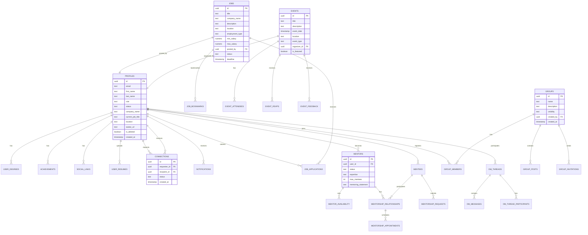
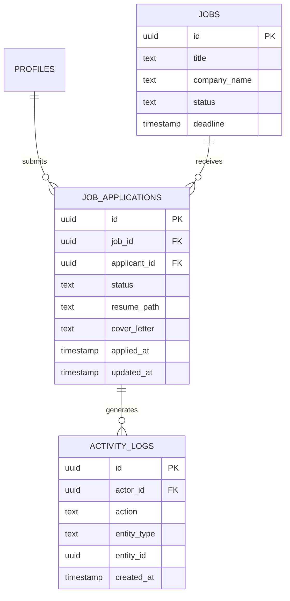
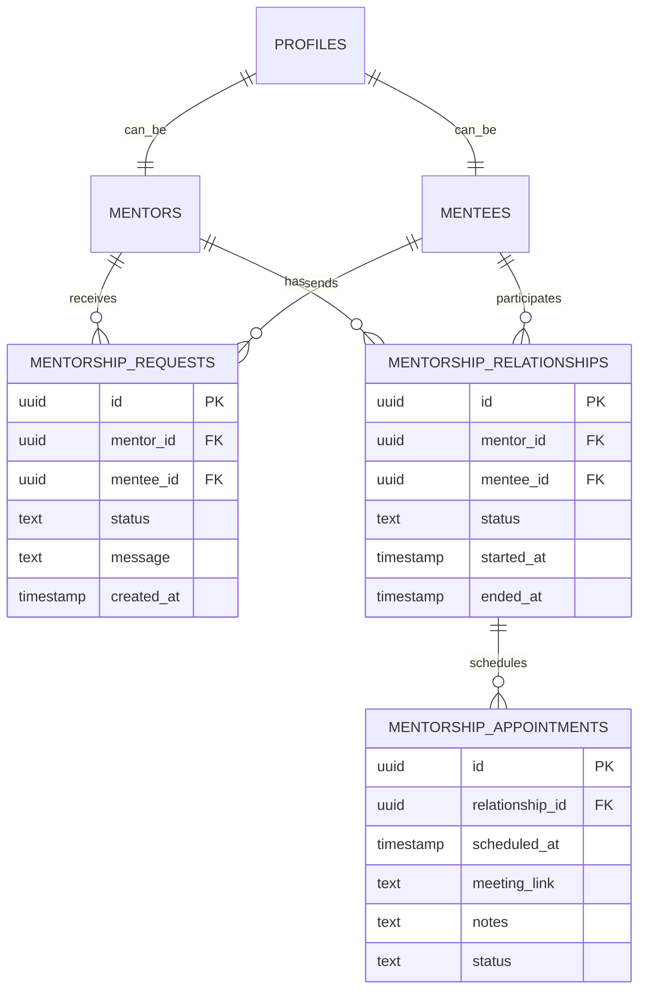
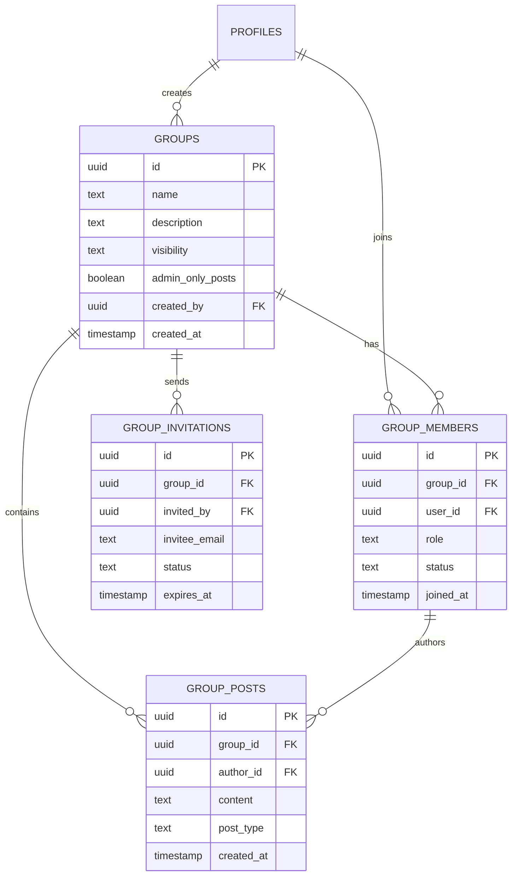
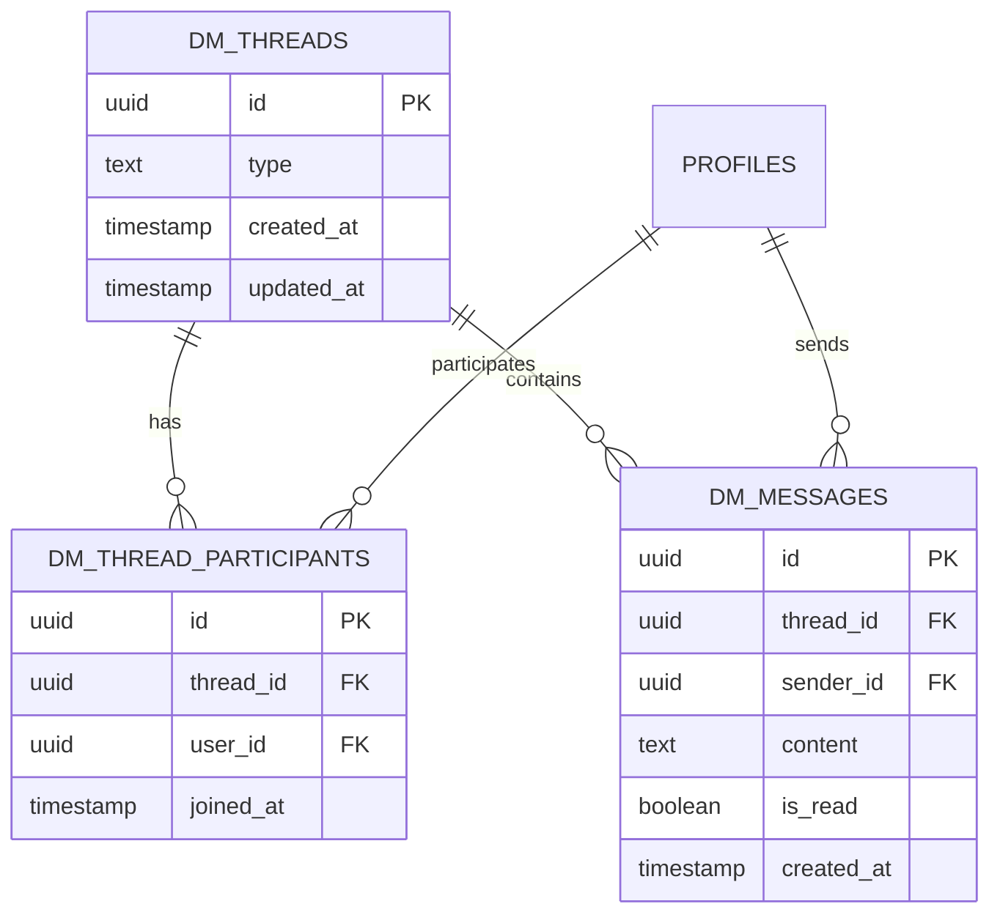
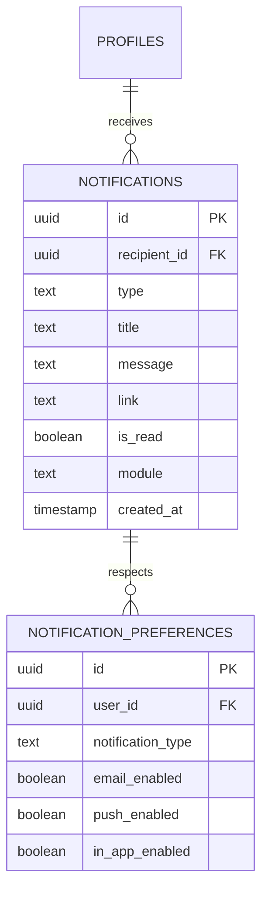

# Forgecircle Alumni Platform — Entity Relationship Diagrams

## Core Data Model



## Authentication & Authorization Model

```mermaid
erDiagram
    AUTH_USERS ||--|| PROFILES : extends
    AUTH_USERS ||--o{ AUTH_IDENTITIES : has
    AUTH_USERS ||--o{ AUTH_SESSIONS : creates
    PROFILES ||--o{ ADMIN_ACTIONS : performs

    AUTH_USERS {
        uuid id PK
        text email
        encrypted_password
        jsonb raw_user_meta_data
        jsonb raw_app_meta_data
        timestamp email_confirmed_at
    }

    PROFILES {
        uuid id PK
        text email
        text role
        text status
        boolean is_admin
        uuid institution_id
    }

    ADMIN_ACTIONS {
        uuid id PK
        uuid admin_id FK
        text action_type
        jsonb target_user_ids
        timestamp created_at
    }
```

## Job Application Flow Data Model



## Mentorship Relationship Model



## Group & Community Model



## Messaging System Model



## Notification System Model



---

*These diagrams represent the core data relationships in the Forgecircle Alumni Platform.*
