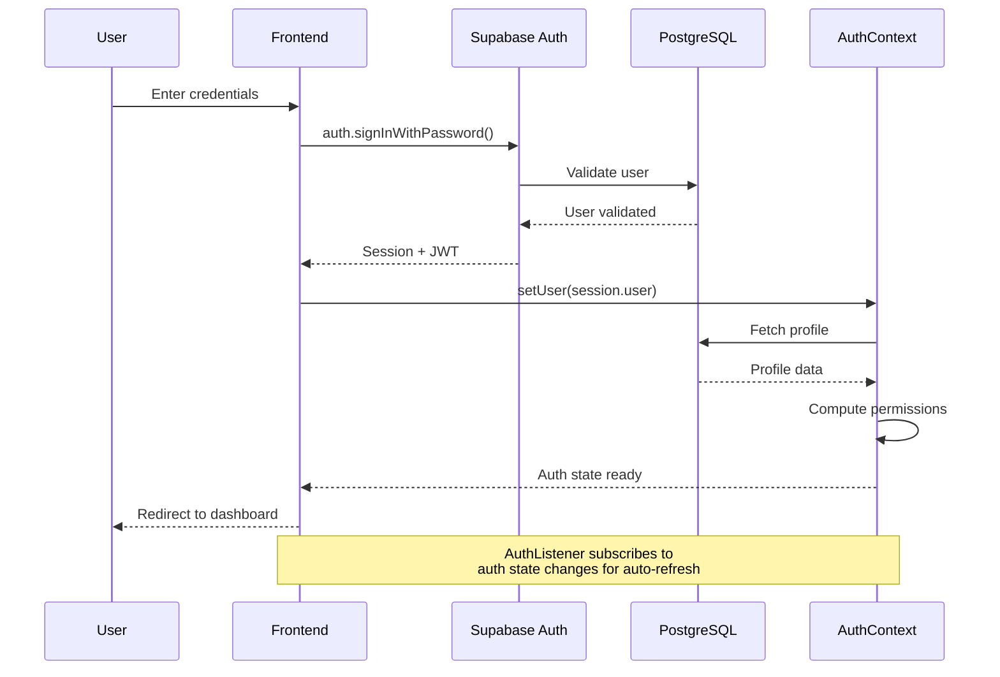
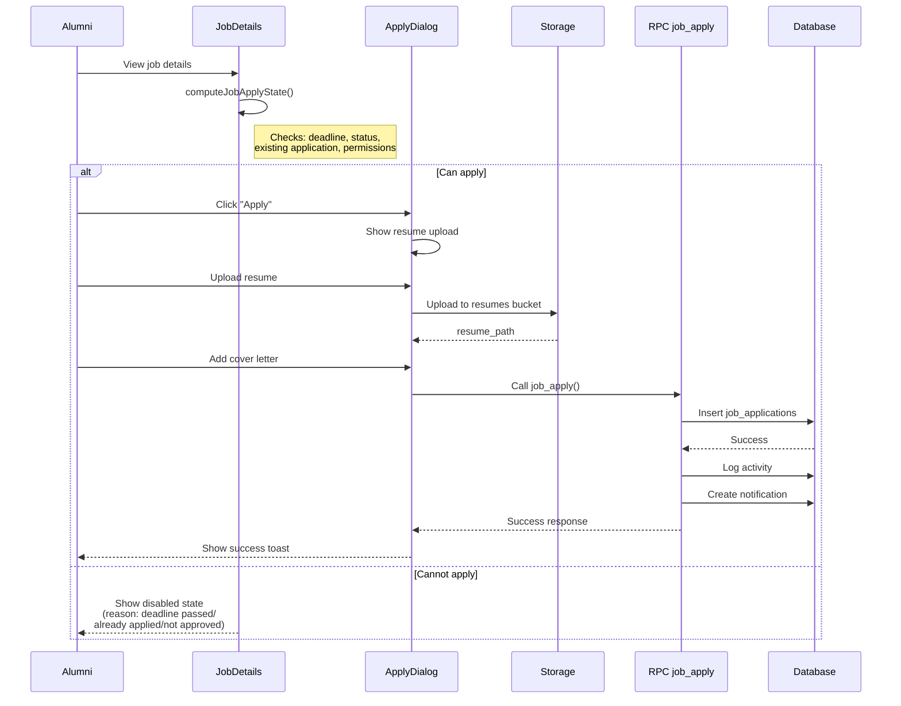
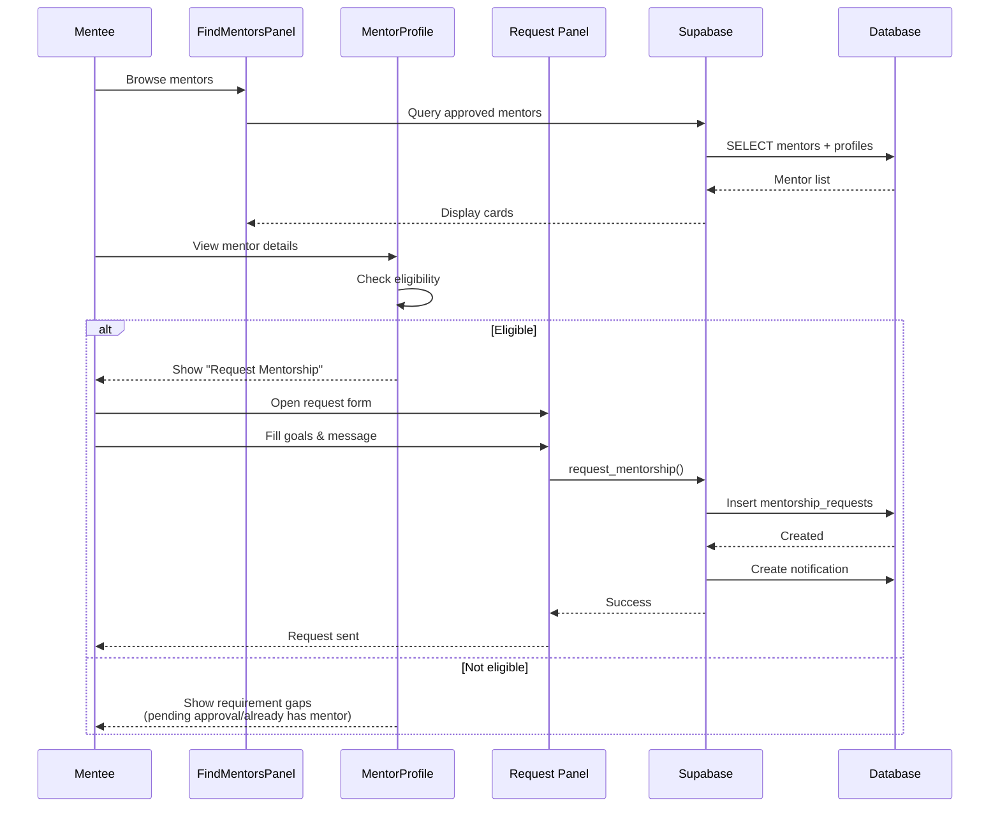
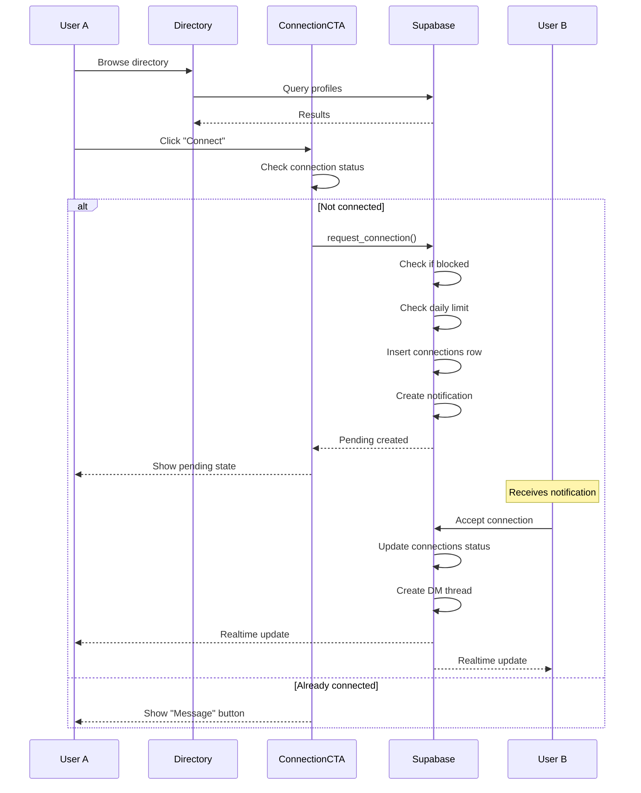
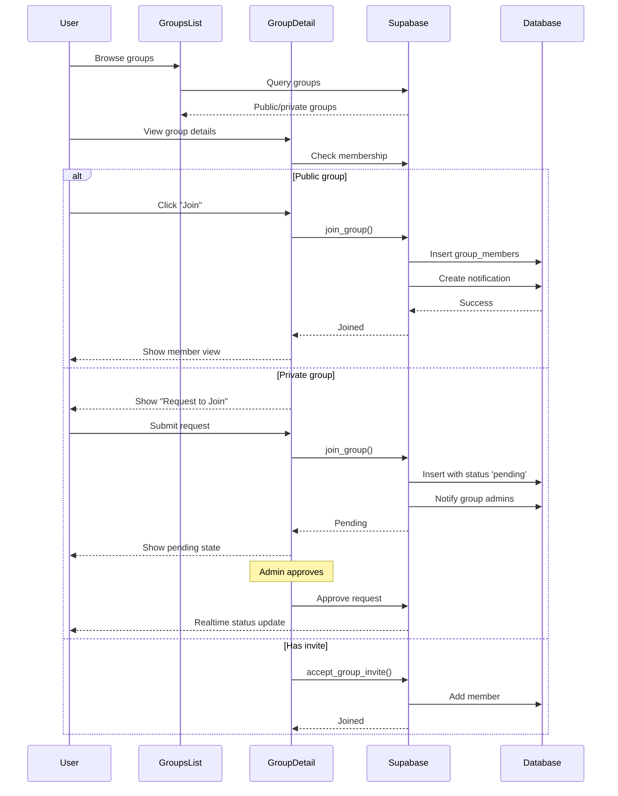
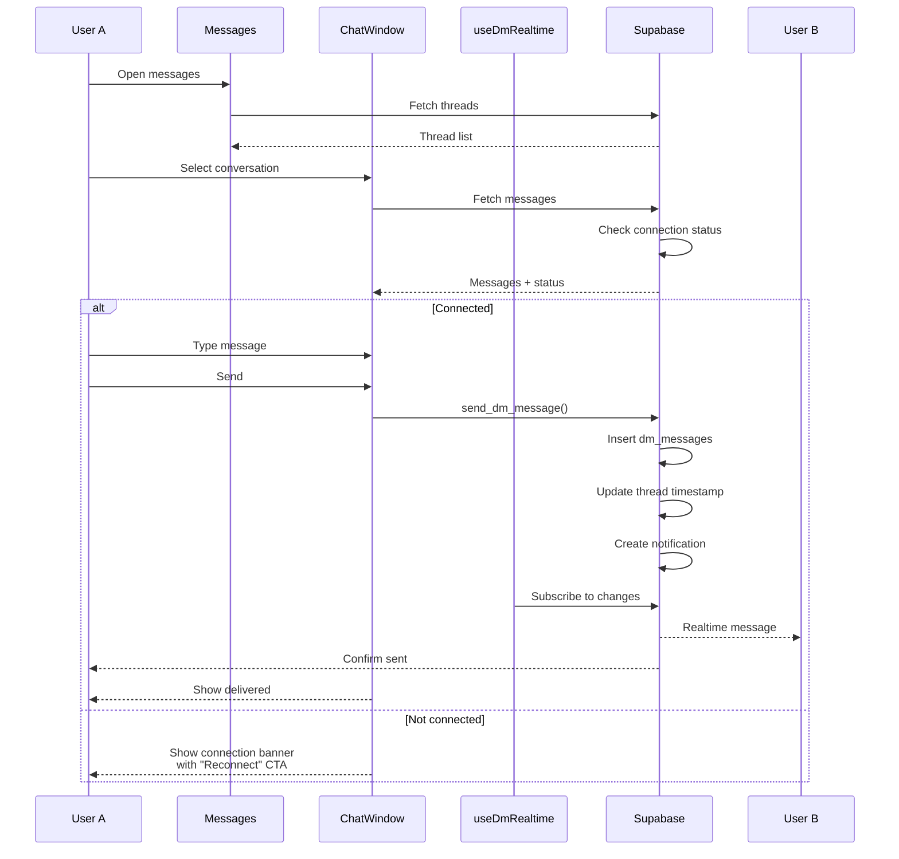
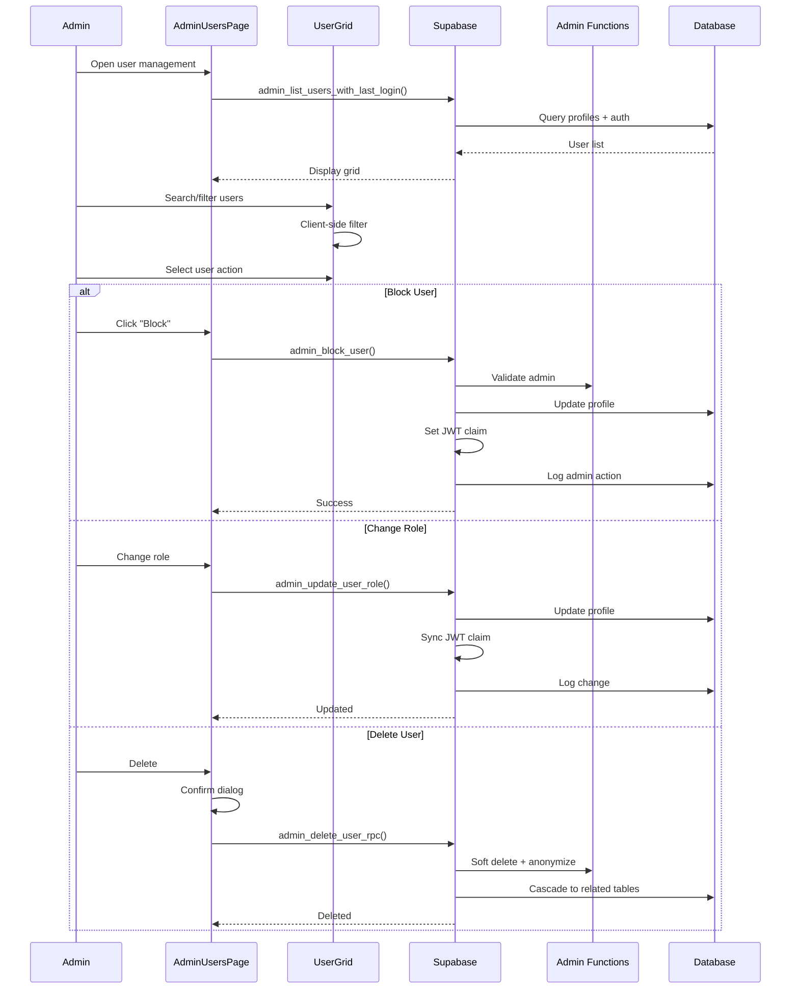
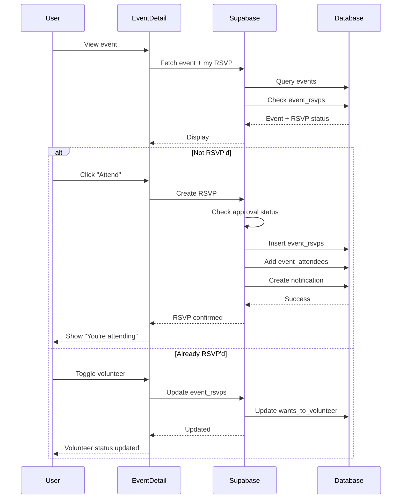
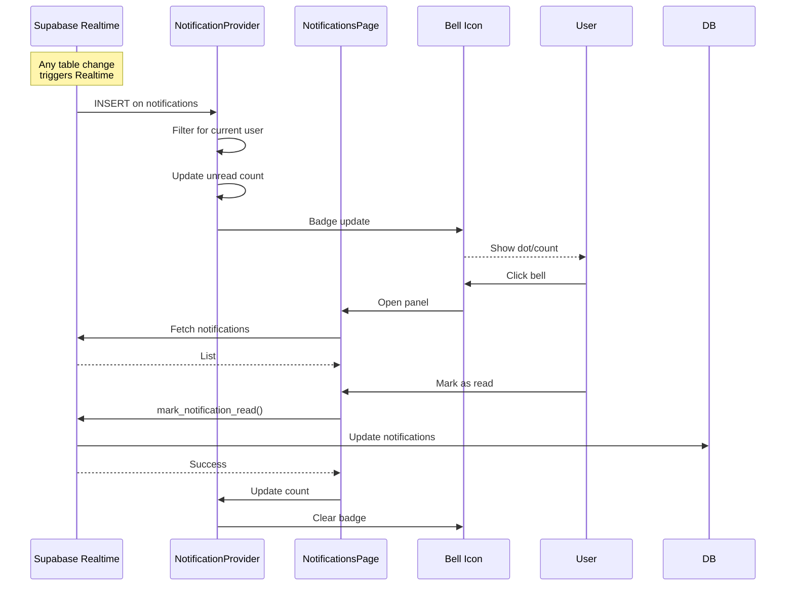
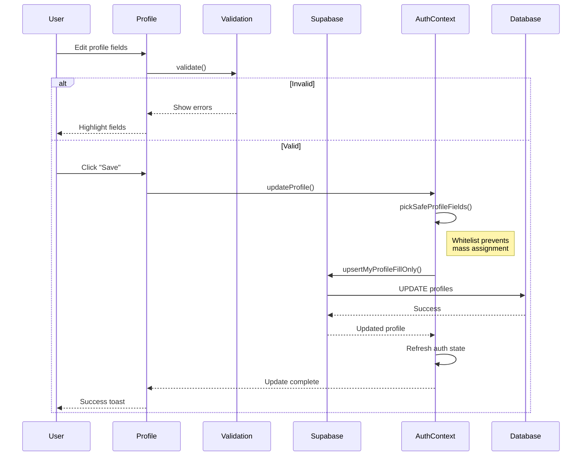

# Forgecircle Alumni Platform — Flow Diagrams

## 1. Authentication Flow

## 2. Job Application Flow

## 3. Mentorship Request Flow

## 4. Connection Request Flow

## 5. Group Join Flow

## 6. Direct Message Flow

## 7. Admin User Management Flow

## 8. Event RSVP Flow

## 9. Real-time Notification Flow

## 10. Profile Update Flow

---

*These sequence diagrams illustrate the primary user flows in the Forgecircle Alumni Platform.*
