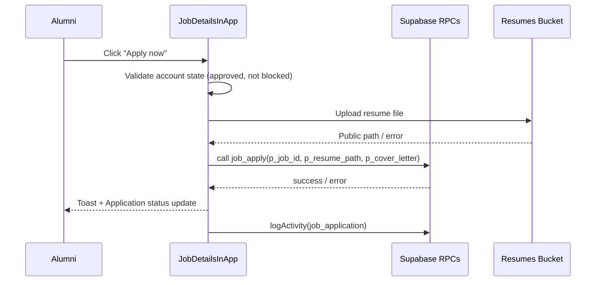
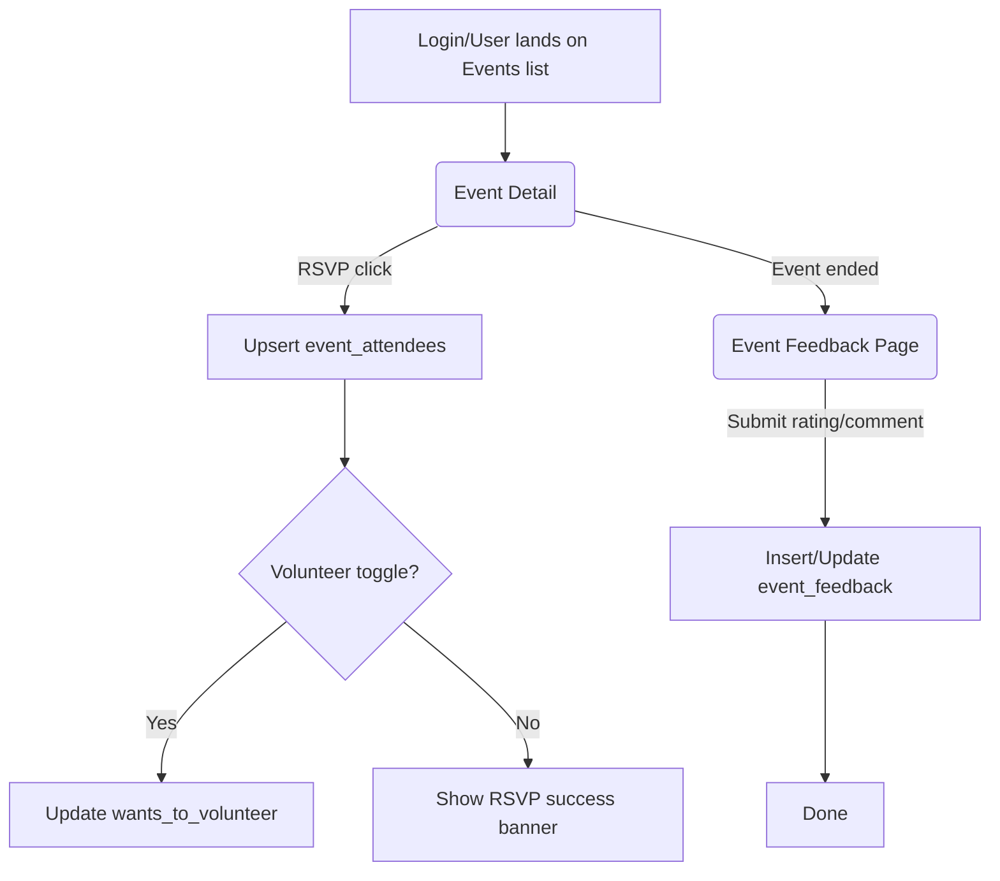
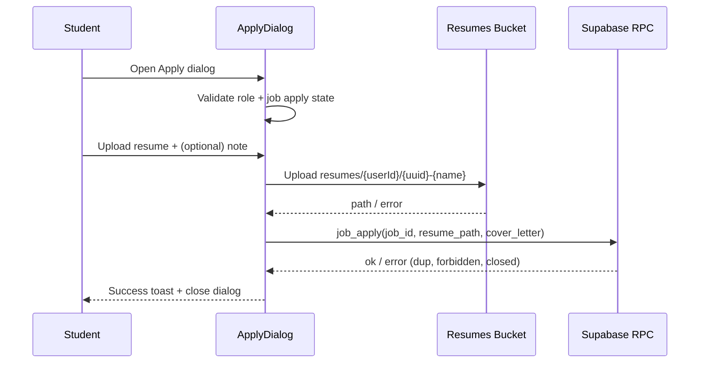
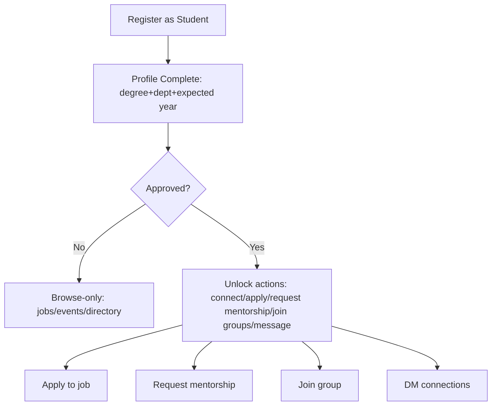
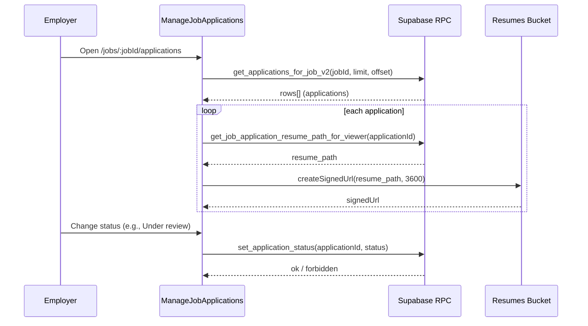
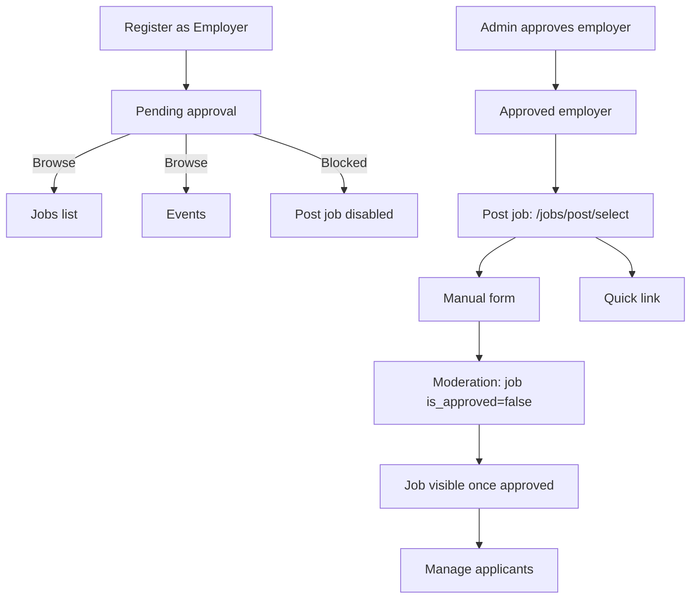
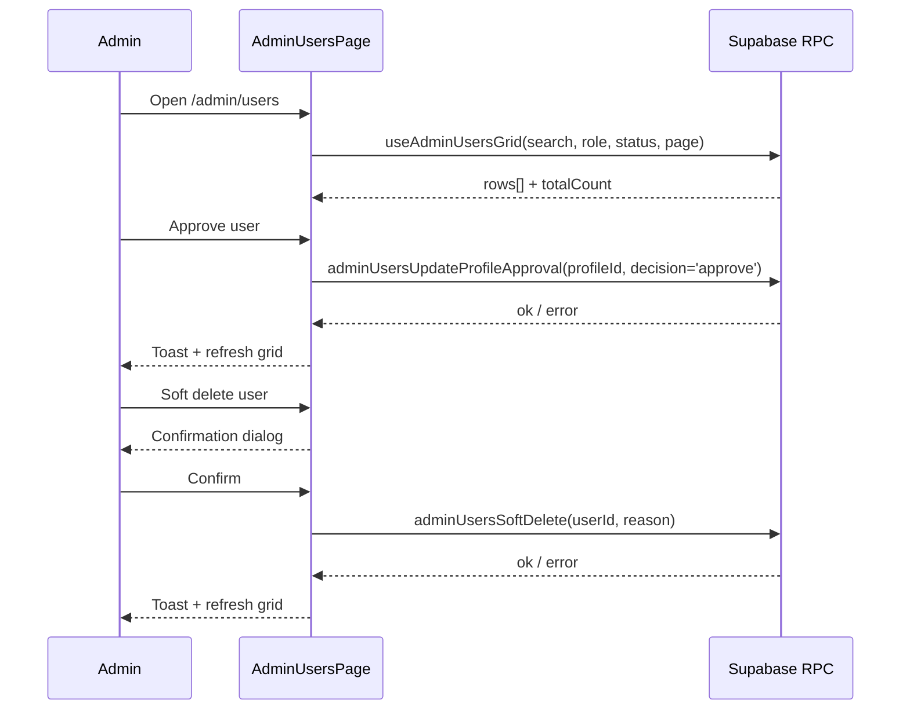
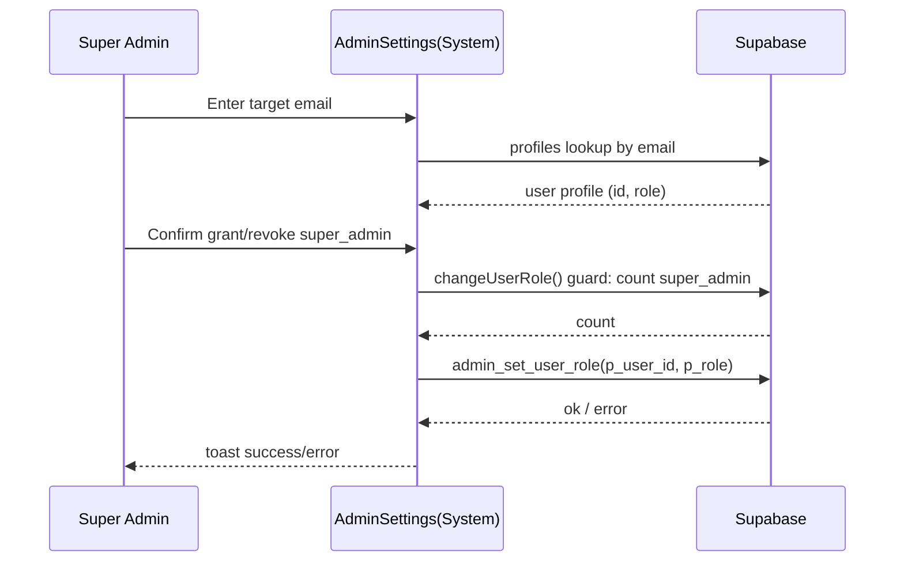
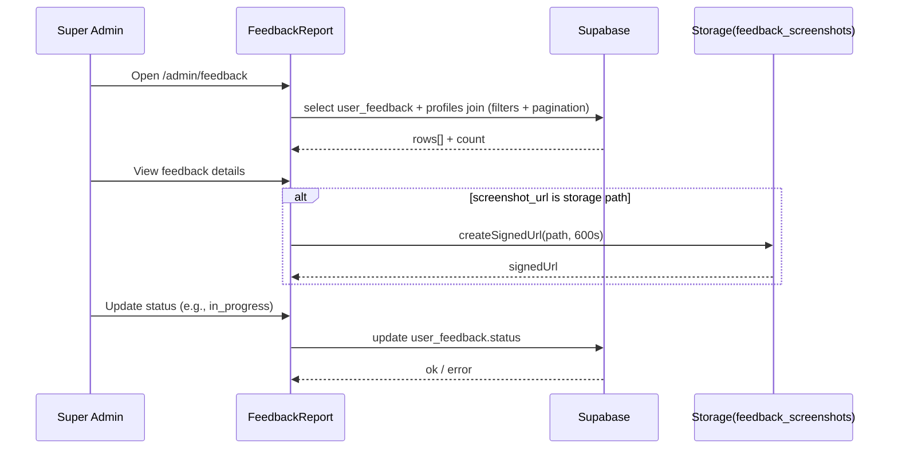

## Alumni End-to-End Flow

### 1. Overview
- **Persona:** Alumni (authenticated Supabase user mapped to `alumni` role by `AuthContext`).
- **Responsibilities:** Maintain profile, discover peers, engage with events, apply to jobs, join mentorship and groups, message connections, manage notifications.
- **Access & RBAC:** Gated by `ProtectedRoute` permissions plus approval state (`useApproval`). Alumni can browse most modules after login but creation/posting actions (connections, RSVPs, job applies) require fully approved + active profile (@frontend/src/components/Auth/ProtectedRoute.js#1-58, @frontend/src/hooks/useApproval.js#1-147).

### 2. Modules & Sub-Features

#### Module: Auth & Profile Foundation
**2.1 Sub-Feature: Enhanced Registration**
**Purpose:** Capture complete Stage-2 profile data during sign-up (all required alumni fields) to avoid separate onboarding.
**Pre-conditions / Entry point:** `/register` route, unauthenticated user.
**Screens & Steps:**
1. **Screen:** Stage 1 – Basic Info
   - **Action:** Enter contact+role details, password, phone.
   - **Fields touched:**
     | Field Label | Field Name | Type | Mandatory | Validations/Constraints |
     |-------------|------------|------|-----------|-------------------------|
     | First Name | `firstName` | text | Yes | Letters/spaces only; trimmed @frontend/src/components/Auth/EnhancedRegister.js#303-320 |
     | Last Name | `lastName` | text | Yes | Letters/spaces only |
     | Email | `email` | email | Yes | Lowercase enforced, format regex, `.co` disallowed, RPC duplicate check @frontend/src/components/Auth/EnhancedRegister.js#265-640 |
     | Password | `password` | password | Yes | Custom password policy `validatePassword` |
     | Phone | `phone` | tel | Yes | E.164 normalization, length per country meta |
     | Primary Role | `primaryRole` | dropdown | Yes | Alumni/student/employer options |
   - **Decisions:** Next step enabled only after `validateStep(1)` passes; RPC `registration_check_identity` ensures unique phone/email.
   - **Expected results:** Stage 1 state persists to localStorage for resume.
2. **Screen:** Stage 2 – Role-Specific Details
   - **Action:** Provide academics, employment, mentorship interest, terms consent.
   - **Fields:**
     | Field Label | Field Name | Type | Mandatory | Validations |
     | Degree | `degree_code` | lookup (DegreeSelect) | Alumni/Student | Must match `useAcademicsCatalog` list |
     | Department | `department_id` | lookup | Alumni/Student | Must belong to selected degree |
     | Graduation Year | `graduationYear` | number | Alumni | Year within allowed range via `validateBatchYear` |
     | Company | `companyName` | text | Alumni | Non-empty |
     | Job Title | `jobTitle` | text | Alumni | Non-empty |
     | Location | `currentLocation` | text | Alumni | Non-empty |
     | Terms | `agreeToTerms` | checkbox | Yes | Must be true |
   - **Decisions:** `signUp` via Supabase `auth.signUp` writes profile payload + stage-2 data; on success, user is redirected or shown verify email modal.
**Post-conditions / Exit:** `profiles` row upserted with safe fields; degree/department stored for later features.

**2.2 Sub-Feature: Profile Completion**
- **Purpose:** Lightweight check for missing required fields when user hits `/complete-profile`.
- **Fields:** email, first/last name, degree program, company, job title, graduation year; validations similar to registration (@frontend/src/components/Auth/ProfileCompletion.jsx#1-182).
- **Decisions:** Save vs error toast (`validate()` ensures alumni have grad year). Avatar optional.

**2.3 Sub-Feature: Profile Edit & Enhancements**
- **Components:** `Profile` (core info), `ProfileResume`, `AdditionalDegreesForm`, `ProfessionalAchievementsForm`.
- **Key Fields & Constraints:**
  - Contact & phone normalization, location, degree/dept selects (with catalog validation) @frontend/src/components/Auth/Profile.js#1-863.
  - Resume upload: accepts pdf/doc/docx ≤3 MB, stored in `resumes` bucket, single active resume enforced (@frontend/src/components/Auth/ProfileResume.js#31-339).
  - Additional degrees: `degree_code`, `institution_name`, `graduation_year`, must set `is_primary=false` (@frontend/src/components/Profile/AdditionalDegreesForm.jsx#1-219).
  - Achievements: category dropdown, title required, optional issuer/date/url/description (@frontend/src/components/Profile/ProfessionalAchievementsForm.jsx#1-325).
- **Permissions:** Only owner; backend RLS ensures `profiles.id = auth.uid()`.

#### Module: Dashboard
**2.4 Sub-Feature: Alumni Dashboard Widgets**
- **Purpose:** Provide quick stats (connections, events, jobs) and activity feed after login.
- **Entry:** `/dashboard` with `RequireCompleteProfile`.
- **Screens & Steps:**
  1. Stats cards and quick actions render after `useAuth` + `useApproval` data ready.
  2. `ActivitiesWidget` fetches `get_recent_activity_for_user_role` RPC and fallback queries for job apps, events, groups, mentorship actions @frontend/src/components/Dashboard/ActivitiesWidget.jsx#1-400.
  3. `MyGroupsWidget` lists top joined groups via `useGroups` hook and provides CTA to `/groups` @frontend/src/components/Dashboard/MyGroupsWidget.jsx#1-210.
- **Decisions:** Pending approval banner shows if `approvalFlags` not approved; quick actions adapt for students vs employers.

#### Module: Directory & Connections
**2.5 Sub-Feature: Directory Search & Filters**
- **Purpose:** Discover alumni, students, employers with secure data.
- **Pre-conditions:** `/directory` route, `view:alumni_directory` permission.
- **Steps:**
  1. `useDirectorySecure` RPC call fetches paginated rows with server-side search/sort (@frontend/src/hooks/useDirectorySecure.js#1-115).
  2. Client filters (batch, department, degree, company, location) applied before rendering grid.
  3. `DirectoryCardSplit` builds chips from profile row + `v_profile_degrees_education` fallback; connection CTA renders per status.
- **Fields surfaced:** Name, batch, degree, department, position, company, location, verified badge, pending status for admins.
- **Decisions:** Employers redirected to `/jobs`; `ConnectionCTA` disables connect when account pending or blocked (@frontend/src/components/shared/ConnectionCTA.jsx#1-280).

**2.6 Sub-Feature: Connection CTA**
- **Purpose:** Manage connection lifecycle directly from Directory/Profile.
- **Actions:** Connect, cancel, accept/decline, remove, message via `/messages?peer=...`.
- **Permissions:** Requires fully approved + active profile; blocked accounts receive inline error.

#### Module: Jobs
**2.7 Sub-Feature: Job Listings & Filters**
- **Purpose:** Show curated job listings depending on role (alumni/students vs employers).
- **Steps:**
  1. `JobListingsPage` loads via `ProtectedRoute` `view:jobs`; toggles `Match My Education` to call `search_jobs_with_education` RPC.
  2. Filters (job type, experience, salary, recency) applied client-side; bookmarks persisted via `job_bookmarks` (@frontend/src/components/Jobs/JobListingsPage.js#1-717).
  3. Card actions: view details, apply (in-app or quick link), manage visibility if owner/admin.

**2.8 Sub-Feature: Job Details & Apply (In-App)**
- **Purpose:** Provide full job description and allow in-app resume submission.
- **Fields:**
  | Field Label | Field Name | Type | Mandatory | Validations |
  |-------------|------------|------|-----------|-------------|
  | Resume Upload | `file` | file | Yes | pdf/doc/docx ≤3 MB; MIME + extension enforced @frontend/src/components/Jobs/ApplyDialog.jsx#11-245 |
  | Cover Letter | `note` | textarea | No | None |
- **Steps:**
  1. `JobDetailsInApp` fetches job + contact info, determines `computeJobApplyState` (in-app vs quick-link, deadlines) @frontend/src/components/Jobs/JobDetailsInApp.jsx#1-384.
  2. If eligible: open `ApplyDialog`, uploads resume to `resumes` bucket, calls RPC `job_apply`, logs activity.
  3. After success, `JobApplicationStatus` displays status per job.
- **Decisions:** Employers or blocked/pending alumni cannot apply; quick-link jobs push user to external URL via modal.

**2.9 Sub-Feature: Job Alerts & Application Tracking**
- **Job Alerts:** Create/edit alerts stored in `job_alerts`; fields include name, keywords, location, job_type, experience, salary range, frequency. Validation ensures ≤50 keywords, min salary ≤ max (@frontend/src/components/Jobs/JobAlerts.js#1-729).
- **Application Tracking:** Lists `job_applications` joined with jobs; filter by status; ensures only alumni/students with `apply:jobs` permission can view (@frontend/src/components/Jobs/ApplicationTracking.js#1-315).

#### Module: Events
**2.10 Sub-Feature: Events Directory & Calendar**
- **Purpose:** Browse, search, RSVP to events.
- **Steps:**
  1. `/events` route renders `EventsList` with grid/list/calendar view toggles; loads featured events, categories, search, sort (@frontend/src/components/Events/EventsList.js#1-695).
  2. Category chips filter results (including Jobs-specific category).

**2.11 Sub-Feature: Event Detail & RSVP**
- **Purpose:** Show event info, manage registration, volunteering, feedback entry point.
- **Fields:** Volunteer toggle, RSVP button states.
- **Decisions:** `handleAttend` upserts `event_attendees`; volunteer preference saved to `event_rsvps` `wants_to_volunteer`. Pending approval or blocked accounts see guard messages (@frontend/src/components/Events/EventDetail.js#1-942).

**2.12 Sub-Feature: Event Feedback**
- **Purpose:** Collect ratings/comments post event.
- **Flow:** `/events/:id/feedback` ensures user attended (`useMyRsvp`) and event ended via `useEventComputedFlags`. Form requires rating int 1–5, optional comments, existing feedback editable (@frontend/src/components/Events/EventFeedback.js#1-313, @frontend/src/components/Events/EventFeedbackForm.jsx#1-310).

#### Module: Mentorship
**2.13 Sub-Feature: Mentorship Hub & Tabs**
- **Purpose:** Consolidate mentee/mentor experiences.
- **Tabs:** Determined by role context (`useMentorshipRoleContext`): Find, My Trainers, My Trainees, Requests, Settings; persist via `tab` query parameter (@frontend/src/components/Mentorship/MentorshipTabs.jsx#1-182).
- **Panel Routing:** `MentorshipHub` reads `tab/sub/mode` and renders corresponding panel (FindMentorsPanel, MyMentorsPanel, MyMenteesPanel, RequestsPanel, MentorshipSettingsPanel). Defaults adapt to pending requests or role state (@frontend/src/components/Mentorship/MentorshipHub.jsx#1-115).
- **Status Banners:** `MentorshipStatusBannerStrip` displays mentee/mentor approval or action-needed banners before tabs render (@frontend/src/components/Mentorship/banners/MentorshipStatusBannerStrip.jsx#1-26).

#### Module: Groups & Networking
**2.14 Sub-Feature: Group Directory & Join Flow**
- **Purpose:** Browse, search, join alumni groups.
- **Steps:**
  1. `/groups` lists cards with privacy, tags, join CTA; employers blocked from viewing.
  2. `GroupsList` fetches paginated results (RPC), tracks membership map, handles join requests with admin-only posts flag, private/invite status, pending banners (@frontend/src/components/Groups/GroupsList.js#1-777).
  3. `GroupDetail` enforces membership/role for posts; join CTA handles invite acceptance, volunteer connections, membership actions (@frontend/src/components/Groups/GroupDetail.js#1-900).

**2.15 Sub-Feature: Create & Manage Group**
- **CreateGroup:** Form fields – name (required), description, tags, privacy toggle, admin-only posts toggle, avatar upload (PNG/JPG ≤2 MB). Validations block unauthorized roles and large files (@frontend/src/components/Groups/CreateGroup.js#1-254).
- **GroupManage:** Admin console for approvals, member roles, invitations, archiving, alumni-only flag management; includes collapsible sections for settings, members, pending requests (@frontend/src/pages/GroupManage.jsx#1-1629).

#### Module: Messaging
**2.16 Sub-Feature: Conversations & Chat**
- **Purpose:** DM connections; enforce connection status before messaging.
- **ConversationList:** Search, unread indicators, connection (green dot) badges; uses `useProfileById` + `useAvatars` for identity display (@frontend/src/components/Messages/ConversationList.js#1-219).
- **ChatWindow:** Loads thread, messages, ensures DM thread exists, enforces `canSend` only when connected + approved, handles connection banners, mentorship context cues, file attachments via `sendDmMessage` (@frontend/src/components/Messages/ChatWindow.js#1-776).
- **MessagingSystem:** Coordinates tabs (Chats vs Connections), handles `peer`/`thread` query params, realtime updates, ensures `ConnectionsPanel` is accessible for pending requests (@frontend/src/components/Messages/MessagingSystem.js#1-437).

#### Module: Notifications & Settings
- **NotificationsPage:** Lists notifications via `notifications.ts` API, includes connection requests, mark read/all read flows, real-time subscriptions (@frontend/src/components/Notifications/NotificationsPage.js#1-411).
- **NotificationSettings:** Toggle grouped notification types (connections, messages, jobs, mentorship, events, system) via `notification_preferences` table; `Restore defaults` re-enables all (@frontend/src/pages/Settings/NotificationSettings.jsx#1-165).

### 3. Cross-Module Actions & Dependencies
- **Supabase Auth ➜ Profiles:** Registration and profile edit flows populate `profiles` table, which drives Directory, Messaging identities, Mentorship role context.
- **Approval Flags:** `useApproval` outputs `isApproved`, `isFullyApproved`, `isApprovedMentor/Mentee/Employer`; gating for Connections, Jobs Apply, Events RSVP, Mentorship tabs.
- **Connections ➜ Messaging:** `ConnectionCTA` updates `connections` table, ChatWindow polls `checkConnectionStatus` to lock/unlock DM input.
- **Events RSVP ➜ Notifications:** RSVP changes recorded in `event_attendees`/`event_rsvps`, which surface in dashboard `ActivitiesWidget` and notifications.
- **Jobs Apply ➜ Application Tracking:** `job_apply` RPC inserts `job_applications`, read by `ApplicationTracking` and `ActivitiesWidget`.
- **Groups ➜ Dashboard:** `MyGroupsWidget` uses membership data to highlight group CTA.

### 4. Summary Tables

| Module | Screen | Actions | Primary Fields |
|--------|--------|---------|----------------|
| Auth | EnhancedRegister | Stage 1/2 capture | Name, email, password, phone, role, degree, department, company |
| Jobs | JobDetailsInApp & ApplyDialog | Resume upload, cover letter, apply | Resume file, note |
| Events | EventDetail | RSVP, volunteer toggle | attendance_status, wants_to_volunteer |
| Mentorship | MentorshipHub Tabs | Tab switch, requests | Query params `tab`, `sub`, `mode` |
| Messaging | ChatWindow | Send, reconnect | Message textarea, connection actions |

**Permissions Matrix (Alumni persona)**

| Feature | Permission Gate | Additional Conditions |
|---------|-----------------|-----------------------|
| Dashboard | `access:dashboard` | `RequireCompleteProfile` |
| Directory | `view:alumni_directory` | Employers redirected to jobs |
| Jobs Apply | `apply:jobs` | `isFullyApproved`, not blocked, job not closed |
| Job Alerts | `view:jobs` | Authenticated |
| Events RSVP | `access:events` | `isApproved` true; volunteer toggle requires RSVP |
| Mentorship Tabs | `request:mentorship` (mentee) / `manage:mentor_profile` | Tabs adapt to role context |
| Groups Create | `canCreateGroup(userRole)` | Non-employer |
| Messaging | `message:users` | Must be connected and approved |
| Notifications Settings | `access:profile_settings` | Authenticated |

### 5. Validation Checklist
- ✅ Registration validation: `validateStep()` ensures required fields, RPC for uniqueness, phone normalization.
- ✅ Profile edit validating phone, degree/department combos, achievements/resumes optional but constrained.
- ✅ Job apply gating: resume type/size, RPC fallback when not participant, `computeJobApplyState` handles quick link.
- ✅ Event RSVP ensures account approval, volunteer preference stored via `event_rsvps`.
- ✅ Mentorship tabs & banners ensure only approved roles see mentee/mentor actions.
- ✅ Messaging connection banners prevent sending when not connected or blocked, with reconnection cooldown.
- ✅ Notifications settings map ensures toggling groups persists to `notification_preferences`.

### 6. Sequence & Screen Flow Diagrams




### 7. Finish Conditions
- Alumni can: maintain complete profile, discover peers, RSVP/apply, join programs, message connections, and configure notifications without encountering RBAC or validation blockers.
- Monitoring: Add analytics/logging (already via `logActivity`) and Supabase policies to ensure data integrity.

---

## Student End-to-End Flow

### 1. Overview
- **Persona role definition:** Student (authenticated Supabase user with `profiles.role = 'student'`).
- **High-level responsibilities:**
  - Maintain accurate student academics (degree + department) and expected graduation year.
  - Browse jobs/events/directory and participate once fully approved.
  - Request mentorship as a mentee, join groups (except alumni-only), message connections.
- **Access levels and RBAC assumptions:**
  - **Base permissions (when fully approved):** `access:dashboard`, `view:jobs`, `apply:jobs`, `access:events`, `view:alumni_directory`, `request:mentorship`, `access:groups`, `message:users`, `access:profile_settings` (@frontend/src/contexts/AuthContext.js).
  - **Pending approval:** Student can browse read-only modules (dashboard, jobs list, events list, directory) but **cannot** apply / connect / join / request mentorship / send messages until `isFullyApproved` is true (permission derivation + `useApproval`) (@frontend/src/contexts/AuthContext.js, @frontend/src/hooks/useApproval.js).
  - **Create content restrictions:** Students cannot create events (`canCreate` requires not student) (@frontend/src/components/Events/EventsList.js).

### 2. All Modules & Features the Student interacts with
- **Auth & Profile Foundation**
- **Dashboard**
- **Directory & Connections**
- **Jobs**
- **Events**
- **Mentorship (Mentee role)**
- **Groups**
- **Messaging**
- **Notifications & Settings**

### 2. Module: Auth & Profile Foundation

**2.1 Sub-Feature: Enhanced Registration (Student)**
**Purpose:** Create a student account with required academics + expected graduation year captured during sign-up.
**Pre-conditions / Entry point:** `/register` route (unauthenticated).
**Screens & Steps:**
1. **Screen:** Stage 1 – Basic Info
   - **Action:** Provide identity + credentials.
   - **Fields touched:**
     | Field Label | Field Name | Type | Mandatory | Validations/Constraints |
     |-------------|------------|------|-----------|-------------------------|
     | First Name | `firstName` | text | Yes | Letters/spaces only; trimmed; invalid chars stripped (@frontend/src/components/Auth/EnhancedRegister.js). |
     | Last Name | `lastName` | text | Yes | Letters/spaces only (@frontend/src/components/Auth/EnhancedRegister.js). |
     | Email | `email` | email | Yes | Lowercased; regex format checks; `.co` blocked (@frontend/src/components/Auth/EnhancedRegister.js). |
     | Password | `password` | password | Yes | ≥12 chars; must include lower/upper/digit/symbol; avoid email local-part; avoid common words (@frontend/src/utils/passwordPolicy.js). |
     | Confirm Password | `confirmPassword` | password | Yes | Must match `password` (@frontend/src/components/Auth/EnhancedRegister.js). |
     | Phone | `phone` | tel | Yes | Normalized to E.164-like `+<digits>`; 7–15 digits; per-country local-length best-effort check (@frontend/src/components/Auth/EnhancedRegister.js). |
     | Primary Role | `primaryRole` | dropdown | Yes | Must be `student` to enter Student flow (@frontend/src/components/Auth/EnhancedRegister.js). |
   - **Decisions:**
     - Next is allowed only if `validateStep(1)` passes.
     - Before advancing, identity uniqueness is checked via RPC `registration_check_identity` (email/phone taken) (@frontend/src/components/Auth/EnhancedRegister.js).
   - **Expected results / output:** Step state persists to localStorage for resume.
2. **Screen:** Stage 2 – Student Details
   - **Action:** Provide student academics and expected year; accept Terms.
   - **Fields touched:**
     | Field Label | Field Name | Type | Mandatory | Validations/Constraints |
     |-------------|------------|------|-----------|-------------------------|
     | Student ID | `studentId` | text | No | Free text; stored as `profiles.student_id` (@frontend/src/components/Auth/EnhancedRegister.js). |
     | Expected Graduation Year | `expectedGraduationYear` | number | Yes | Validated by `validateBatchYear(year,'student')`: numeric; 1970..(currentYear+6) (@frontend/src/utils/batchYear.js, @frontend/src/components/Auth/EnhancedRegister.js). |
     | Degree | `degree_code` | lookup (DegreeSelect) | Yes | Must be valid per DB-driven catalog (`useAcademicsCatalog`) (@frontend/src/components/Auth/EnhancedRegister.js). |
     | Department | `department_id` | lookup (DepartmentSelect) | Yes | Must belong to selected degree (catalog validation) (@frontend/src/components/Auth/EnhancedRegister.js). |
     | Current Location | `currentLocation` | text | No | Optional for student; stored to `profiles.location` if provided (@frontend/src/components/Auth/EnhancedRegister.js).
     | Brief Bio | `bio` | textarea | No | Optional; stored to `profiles.about` (mapped in upsert payload) (@frontend/src/components/Auth/EnhancedRegister.js).
     | Skills | `skills` | multi-select chips + custom entry | No | Client enforces ≤5 skills; custom split by comma/space (@frontend/src/components/Auth/EnhancedRegister.js).
     | Interests | `interests` | multi-select chips | No | Optional (@frontend/src/components/Auth/EnhancedRegister.js).
     | Website | `websiteUrl` | text/url | No | Normalized to https; must be valid https URL if provided (@frontend/src/components/Auth/EnhancedRegister.js).
     | Terms | `agreeToTerms` | checkbox | Yes | Must be true (@frontend/src/components/Auth/EnhancedRegister.js).
   - **Decisions:** Submit → Supabase `auth.signUp` with `options.data` mapped to profile columns; year written to `expected_graduation_year` using `getProfileYearWriteFields('student', year)` (@frontend/src/components/Auth/EnhancedRegister.js, @frontend/src/utils/batchYear.js).
   - **Expected results / output:** Student account created, profile upsert performed when session is available; redirect to `/auth/callback` then `/dashboard`.
**Post-conditions / Exit points:** Student is authenticated; approval status may be `pending` until admin approves.

**Alternate & Error Flows:**
- **Case: Email/phone already registered**
  - RPC `registration_check_identity` returns `email_taken`/`phone_taken` → user blocked from proceeding.
- **Case: Invalid expected graduation year**
  - `validateBatchYear` fails (non-numeric/out-of-range) → field error; cannot submit.
- **Case: Degree/department invalid**
  - DB-driven catalog validation fails → toast and block submit.
- **Case: Terms not accepted**
  - `agreeToTerms=false` → error and block submit.

**Permissions / Visibility:**
- **Unauthenticated only**; once signed in, protected routes apply.

**2.2 Sub-Feature: Profile Edit (Student)**
**Purpose:** Maintain correct student profile data used by Jobs match, Directory display, and Mentorship eligibility.
**Pre-conditions / Entry point:** `/profile` (via Profile Settings), authenticated.
**Screens & Steps:**
1. **Screen:** Profile Edit (`Profile`)
   - **Action:** Update core profile fields.
   - **Fields touched (student-relevant subset):**
     | Field Label | Field Name | Type | Mandatory | Validations/Constraints |
     |-------------|------------|------|-----------|-------------------------|
     | First Name | `first_name` | text | Yes | Required (non-empty). |
     | Last Name | `last_name` | text | Yes | Required (non-empty). |
     | Email | `email` | email | Yes | Basic regex validity check. |
     | Phone | `phone` | tel | No/Yes (business rule) | Normalized + uniqueness pre-check (`profiles.phone` unique across users) (@frontend/src/components/Auth/Profile.js). |
     | Location | `location` | text | Yes | Required for non-employer users (@frontend/src/components/Auth/Profile.js). |
     | Degree | `degree_code` | lookup | Yes | Must be valid in catalog (`useAcademicsCatalog`) (@frontend/src/components/Auth/Profile.js). |
     | Department | `department_id` | lookup | Yes | Must belong to selected degree (@frontend/src/components/Auth/Profile.js). |
     | Batch Year (Student) | `batchYear` | number | Yes | Validated via `validateBatchYear(batchYear,'student')`; written to `expected_graduation_year` and clears `graduation_year` (@frontend/src/utils/batchYear.js, @frontend/src/components/Auth/Profile.js). |
     | Student ID | `student_id` | text | No | Stored to `profiles.student_id`. |
     | Avatar | `imageFile` | file | No | Uploaded via `AvatarService.uploadAvatar`; best-effort; does not block profile save (@frontend/src/components/Auth/Profile.js). |
     | Social Links | `socialLinks.linkedin` / `.facebook` / `.twitter` / `.website` | text/url | No | Stored via `saveProfileSocialLinks` (table-backed), not in profiles JSON (@frontend/src/components/Auth/Profile.js). |
   - **Decisions:** Save updates → `profiles.update(...).eq('id', user.id)` and refresh AuthContext.
**Post-conditions / Exit points:** Student profile becomes “complete” (degree+department+expected year) for `isFullyApproved` computation.

**Alternate & Error Flows:**
- **Case: Catalog not loaded** → toast “Degree data is still loading” and block submit.
- **Case: Invalid/empty required fields** → toast listing missing fields (Location, Degree, Department, Year).
- **Case: Phone already used** → toast “This phone number is already registered…” and block submit.

**Permissions / Visibility:**
- Only the profile owner can edit; non-admin users are subject to approval state, but profile editing is still accessible via `access:profile_settings`.

### 2. Module: Dashboard

**2.3 Sub-Feature: Student Dashboard (shared dashboard component)**
**Purpose:** Give student quick entry points into Jobs, Events, Directory, Mentorship, Groups, Messages.
**Pre-conditions / Entry point:** `/dashboard` inside `RequireCompleteProfile` (profile completeness check) + `ProtectedRoute requiredPermission="access:dashboard"` (@frontend/src/App.js).
**Screens & Steps:**
1. **Screen:** Dashboard
   - **Action:** View counts + quick actions.
   - **Key behaviors:**
     - Reads role from AuthContext (`role === 'student'`) and shows student-appropriate tiles (jobs, events, mentorship).
     - Loads summary via RPC `get_dashboard_summary_for_user(p_user_id)` (@frontend/src/components/Dashboard/AlumniDashboard.js).
   - **Decisions:**
     - Student can browse modules even if pending, but action CTAs (apply/connect/message/join) may be gated downstream.

**Alternate & Error Flows:**
- RPC fails → toast “Failed to load dashboard data…”; partial widgets may still render.

### 2. Module: Directory & Connections

**2.4 Sub-Feature: Directory Browse/Search (Student)**
**Purpose:** Student discovers alumni and other students; can connect only when fully approved.
**Pre-conditions / Entry point:** `/directory` with `view:alumni_directory` permission.
**Screens & Steps:**
1. **Screen:** Directory
   - **Action:** Search, paginate, filter.
   - **Fields touched:**
     | Field Label | Field Name | Type | Mandatory | Validations/Constraints |
     |-------------|------------|------|-----------|-------------------------|
     | Search | `searchTerm` → `debouncedSearch` | text | No | Debounced; server-side search via `useDirectorySecure` RPC. |
     | Sort | `sortBy` | dropdown | No | Default `full_name,asc`. |
     | Filters | `filters.graduation_year` / `department` / `degree_program` / `current_job_title` / `company` / `location` | text/select | No | Client-side filtering applied after secure RPC fetch (@frontend/src/components/Directory/DirectoryPage.jsx). |
   - **Decisions:**
     - Student can view “Alumni” and “Students” chips.
     - Employer counts are hidden for students (`countsForChips.employers = undefined`).
2. **Screen:** Directory Card → Connection CTA
   - **Action:** Connect / Cancel / Message.
   - **Decision gates:**
     - `Connect` requires `isFullyApproved && !isBlocked`; otherwise disabled with “Pending approval – cannot connect” or blocked copy (@frontend/src/components/shared/ConnectionCTA.jsx).

**Alternate & Error Flows:**
- Directory RPC error → ErrorState banner; user can retry.

**Permissions / Visibility:**
- Student can browse directory (`view:alumni_directory`).
- Connection creation is blocked in UI until fully approved; DB/RLS must still enforce this server-side.

### 2. Module: Jobs

**2.5 Sub-Feature: Job Listings (Student)**
**Purpose:** Browse approved/active jobs; optionally use “Match My Education” to filter.
**Pre-conditions / Entry point:** `/jobs` with `view:jobs` permission.
**Screens & Steps:**
1. **Screen:** Jobs List
   - **Actions:** Search, filter, open details, bookmark.
   - **Fields touched (filters/search):**
     | Field Label | Field Name | Type | Mandatory | Validations/Constraints |
     |-------------|------------|------|-----------|-------------------------|
     | Search | `searchQuery` | text | No | Client-side match + server fetch logic; debounced internally. |
     | Job Type | `filters.jobType` | dropdown | No | Values include `full-time`, `part-time`, `contract`, `internship`, `temporary`. |
     | Experience | `filters.experience` | dropdown | No | Values include `entry`, `mid`, `senior`, `director+`. |
     | Salary Range | `filters.salaryRange` | dropdown | No | Range tokens like `0-300000`, `1500000-`. |
     | Posted Within | `filters.postedWithin` | dropdown | No | Days: `1`, `7`, `30`, `90`. |
     | Match My Education | `matchMyEducation` | toggle | No | Uses `search_jobs_with_education` RPC when enabled. |
   - **Decisions:**
     - Student pending approval can still browse jobs; apply is gated in Job Details + Apply dialog.

**2.6 Sub-Feature: Job Details + Apply (In-App) (Student)**
**Purpose:** Apply to in-app jobs using a resume upload.
**Pre-conditions / Entry point:** `/jobs/:id`.
**Screens & Steps:**
1. **Screen:** Job Details (In-App)
   - **Action:** Click `Apply now`.
   - **Decision gates:**
     - Requires `isApproved` (approval) and non-employer; if blocked, action is refused with error toast.
     - Uses `computeJobApplyState(job)` to compute `canApplyInApp` and show disabled reason if closed/unapproved/rejected/deadline passed (@frontend/src/utils/jobs.js, @frontend/src/components/Jobs/JobDetailsInApp.jsx).
2. **Screen:** Apply Dialog (`ApplyDialog`)
   - **Action:** Upload resume, optional note, submit.
   - **Fields touched:**
     | Field Label | Field Name | Type | Mandatory | Validations/Constraints |
     |-------------|------------|------|-----------|-------------------------|
     | Resume | `file` | file | Yes | PDF/DOC/DOCX; MIME must match; extension must be in {pdf,doc,docx}; max size 3MB; input `accept` enforces allowed types (@frontend/src/components/Jobs/ApplyDialog.jsx). |
     | Note | `note` | textarea | No | Optional. |
   - **Decisions:**
     - Submit calls Storage upload to `resumes/{userId}/{uuid}-{safeName}` then RPC `job_apply(p_job_id, p_resume_path, p_cover_letter)`.
     - Duplicate apply errors (`23505` / “already applied”) show friendly error.
**Post-conditions / Exit points:** `job_applications` row created; activity logged via `logActivity({action:'job_application'})`.

**2.7 Sub-Feature: My Applications (Student)**
**Purpose:** Track statuses for in-app job applications.
**Pre-conditions / Entry point:** `/jobs/applications` (primary). Legacy route: `/my-applications`.
**Screens & Steps:**
1. **Screen:** My applications
   - **Action:** Filter by status.
   - **Fields touched:**
     | Field Label | Field Name | Type | Mandatory | Validations/Constraints |
     |-------------|------------|------|-----------|-------------------------|
     | Filter by status | `filter` | dropdown | No | Canonical statuses via `normalizeStatus` (submitted/under_review/shortlisted/interviewing/offered/hired/rejected/withdrawn) (@frontend/src/components/Jobs/ApplicationTracking.js). |
   - **Decisions:**
     - If role is not student/alumni → redirected to `/jobs` with toast.
   - **Expected results:** List shows signed resume link (signed URL) when available.

**2.8 Sub-Feature: Job Alerts (Student)**
**Purpose:** Save search alerts for periodic job notifications.
**Pre-conditions / Entry point:** `/jobs/alerts`.
**Screens & Steps:**
1. **Screen:** Alerts list
   - **Action:** Create or edit an alert.
2. **Screen:** Alert form
   - **Fields touched:**
     | Field Label | Field Name | Type | Mandatory | Validations/Constraints |
     |-------------|------------|------|-----------|-------------------------|
     | Alert Name | `alert_name` | text | Yes | Must be non-empty; unique constraint enforced (duplicate → `23505`). |
     | Keywords | `keywords` | text | No | Comma-separated → array; max 50 keywords (extras ignored with warning). |
     | Location | `location` | text | No | Optional string; sent as `null` to RPC when empty. |
     | Job Type | `job_type` | dropdown | No | UI token → DB token via map (`any`→null, `full-time`, `internship`, etc.). |
     | Experience Level | `experience_level` | dropdown | No | UI token → DB token via map (`any`→null, `entry`/`mid`/`senior`/`lead`). |
     | Min Salary | `min_salary` | number | No | If both min/max set, must satisfy min ≤ max. |
     | Max Salary | `max_salary` | number | No | Must satisfy max ≥ min. |
     | Frequency | `frequency` | dropdown | No | `daily`/`weekly`/`biweekly`/`monthly`. |
     | Active | `is_active` | checkbox | No | Defaults true. |
   - **Decisions:**
     - Create calls RPC `create_job_alert(...)`; edit calls `update_job_alert(...)`.

### 2. Module: Events

**2.9 Sub-Feature: Events Browse (Student)**
**Purpose:** Browse published events; students cannot create events.
**Pre-conditions / Entry point:** `/events`.
**Screens & Steps:**
1. **Screen:** Events List
   - **Action:** Search, sort, change view (grid/list/calendar), filter by category.
   - **Fields touched:**
     | Field Label | Field Name | Type | Mandatory | Validations/Constraints |
     |-------------|------------|------|-----------|-------------------------|
     | Search | `searchTerm` | text | No | Client-side filter; triggers fetch. |
     | Sort | `sortBy` | dropdown | No | Default `upcoming`. |
     | View Mode | `viewMode` | toggle | No | `grid` / `list` / `calendar`. |
     | Category | `activeCategory` | dropdown/chips | No | Includes `jobs` bucket (calendar options) (@frontend/src/components/Events/EventsList.js). |
   - **Permissions/Visibility:** Create Event button hidden because `userRole === 'student'` even if permission exists.

**2.10 Sub-Feature: Event Detail + RSVP (Student)**
**Purpose:** Register interest/attendance and optionally volunteer.
**Pre-conditions / Entry point:** `/events/:id`.
**Screens & Steps:**
1. **Screen:** Event Detail
   - **Action:** RSVP.
   - **Fields touched:**
     | Field Label | Field Name | Type | Mandatory | Validations/Constraints |
     |-------------|------------|------|-----------|-------------------------|
     | RSVP status | `attendance_status` | state/button | Yes | Written to `event_attendees`/`event_rsvps` depending on flow; gated by approval status. |
     | Volunteer | `wants_to_volunteer` | checkbox/toggle | No | Upsert to `event_rsvps` with `(event_id,user_id)` conflict key (@frontend/src/components/Events/EventDetail.js). |
   - **Decisions:**
     - If not approved, RSVP actions are disabled/blocked.

**2.11 Sub-Feature: Event Feedback (Student)**
**Purpose:** Provide structured feedback after attending.
**Pre-conditions / Entry point:** `/events/:id/feedback` (only after event ended and user attended).
**Screens & Steps:**
1. **Screen:** Feedback Form
   - **Fields touched:**
     | Field Label | Field Name | Type | Mandatory | Validations/Constraints |
     |-------------|------------|------|-----------|-------------------------|
     | Overall Experience | `overall_rating` | star rating | Yes | Must be ≥1 to submit; range 1–5. |
     | Content | `content_rating` | star rating | No | 0–5. |
     | Speakers | `speakers_rating` | star rating | No | 0–5. |
     | Logistics | `logistics_rating` | star rating | No | 0–5. |
     | Venue | `venue_rating` | star rating | No | 0–5. |
     | Communication | `communication_rating` | star rating | No | 0–5. |
     | What worked well | `worked_well` | textarea | No | maxLength 1000. |
     | What could improve | `could_improve` | textarea | No | maxLength 1000. |
     | Future suggestions | `future_suggestions` | textarea | No | maxLength 500. |
     | Interest level | `interest_level` | button group | No | Must be one of `INTEREST_LEVELS` values. |
   - **Decisions:** Submit uses `useEventFeedback.submitFeedback`; editing is disabled if feedback already submitted (`hasSubmittedFeedback`).

### 2. Module: Mentorship (Student as Mentee)

**2.12 Sub-Feature: Find Trainers + Request Mentorship**
**Purpose:** Student discovers approved mentors and sends mentorship requests.
**Pre-conditions / Entry point:** `/mentorship` (or `/mentorship?tab=find` via hub).
**Screens & Steps:**
1. **Screen:** Find Trainers (`FindMentorsPanel`)
   - **Action:** Search mentors; filter “accepting only”.
   - **Fields touched:**
     | Field Label | Field Name | Type | Mandatory | Validations/Constraints |
     |-------------|------------|------|-----------|-------------------------|
     | Search | `searchQuery` | text | No | Client-side filter over fetched mentor list. |
     | Show accepting only | `showAcceptingOnly` | checkbox | No | Filters by `is_available_for_mentorship` and capacity. |
   - **Decision gates:**
     - Mentor list fetched via RPC `get_mentors_for_current_mentee(p_limit,p_offset)`.
     - Pending request limit enforced in UI (max 5) via `useMentorshipSummary`.
2. **Screen:** Mentor Profile (`MentorProfile`) → Request modal
   - **Action:** Submit mentorship request with a short message/goals.
   - **Fields touched:**
     | Field Label | Field Name | Type | Mandatory | Validations/Constraints |
     |-------------|------------|------|-----------|-------------------------|
     | Message | `requestMessage` | textarea | Conditionally | Must provide message or goals (at least one non-empty) (@frontend/src/components/Mentorship/MentorProfile.js). |
     | Goals | `requestGoals` | textarea | Conditionally | Must provide message or goals (at least one non-empty). |
   - **Decisions:**
     - If student not approved as mentee → toast and block.
     - Duplicate pending request is checked client-side and blocked; RPC enforces again.
     - Submit calls RPC `mentorship_request_create(p_mentor_id, p_message, p_goals)` via mentorship service/API wrappers.

**2.13 Sub-Feature: View/Cancel Requests (Student)**
**Purpose:** Student tracks outgoing mentorship requests and cancels if needed.
**Pre-conditions / Entry point:** `/mentorship?tab=requests&sub=sent`.
**Screens & Steps:**
1. **Screen:** Requests (Sent)
   - **Action:** Cancel pending request.
   - **Decisions:** Cancel calls RPC `mentorship_request_cancel(p_request_id)` via `cancelMentorshipRequest` (@frontend/src/api/mentorshipApi.js).

### 2. Module: Groups

**2.14 Sub-Feature: Browse + Join Groups (Student)**
**Purpose:** Student joins relevant groups (not alumni-only), participates in posts once member.
**Pre-conditions / Entry point:** `/groups` with `access:groups`.
**Screens & Steps:**
1. **Screen:** Groups List
   - **Action:** Search and join/request.
   - **Decision gates:**
     - Join button disabled if account is blocked or not approved (`isApproved` from `useApproval`).
     - `canJoinGroup` denies alumni-only groups for students (`group.alumni_only && role==='student'`) (@frontend/src/utils/acl.js).
2. **Screen:** Group Detail
   - **Action:** View posts (public groups) / join (private groups require request/invite).
   - **Fields touched (posting/reporting subset):**
     | Field Label | Field Name | Type | Mandatory | Validations/Constraints |
     |-------------|------------|------|-----------|-------------------------|
     | New Post | `newPostContent` | textarea | Conditionally | Only members (and depending on `is_admin_only_posts`) can post. |
     | Post Image | `postImage` | file | No | Uploaded via group post image helper (storage). |
     | Report Reason | `reportReason` | textarea | Conditionally | Required to report a post (modal-based). |
   - **Decisions:**
     - Students cannot create groups (`canCreateGroup(role)` excludes students) (@frontend/src/utils/acl.js).

### 2. Module: Messaging

**2.15 Sub-Feature: Direct Messages (Student)**
**Purpose:** Message connected users; chat is gated by connection + approval.
**Pre-conditions / Entry point:** `/messages` with `message:users`.
**Screens & Steps:**
1. **Screen:** Messaging System
   - **Action:** Switch tabs Chats/Connections; pick a conversation.
   - **Decision gates:** Thread list fetched from `v_my_dm_threads` via API; realtime subscription updates.
2. **Screen:** Chat Window
   - **Action:** Send message.
   - **Fields touched:**
     | Field Label | Field Name | Type | Mandatory | Validations/Constraints |
     |-------------|------------|------|-----------|-------------------------|
     | Message | `newMessage` | textarea/input | Yes | Blocked unless `isFullyApproved && !isBlocked && connected` (derived from thread state + latest connection edge) (@frontend/src/components/Messages/ChatWindow.js). |
   - **Decisions:**
     - If not connected, UI shows connection actions; once connected, `can_send` becomes true.

### 2. Module: Notifications & Settings

**2.16 Sub-Feature: Notifications Inbox**
**Purpose:** View and manage notifications; connection request items visible.
**Pre-conditions / Entry point:** `/notifications`.
**Screens & Steps:**
1. **Screen:** Notifications Page
   - **Actions:** Filter by tab (all/unread/read), mark one read, mark all read.
   - **Decisions:** Uses TS API wrappers (RPC-based) for fetch and mark-read; subscribes to realtime notifications.

**2.17 Sub-Feature: Notification Settings**
**Purpose:** Toggle which notification types are enabled in-app.
**Pre-conditions / Entry point:** `/settings/notifications`.
**Screens & Steps:**
1. **Screen:** Notification Settings
   - **Fields touched:**
     | Field Label | Field Name | Type | Mandatory | Validations/Constraints |
     |-------------|------------|------|-----------|-------------------------|
     | Group toggles | `NOTIFICATION_GROUPS[*].types[]` → `prefsByType[type]` | checkbox | No | Upserts to `notification_preferences` with conflict key `(user_id, notification_type)` (@frontend/src/pages/Settings/NotificationSettings.jsx). |
   - **Decisions:**
     - Toggle group updates all types in that group.
     - “Restore defaults” sets all known types to enabled.

### 3. Cross-Module Actions & Dependencies
- **Approval gating (critical):**
  - Student may browse read-only modules while pending.
  - Mutating actions require `isFullyApproved` and non-blocked:
    - **Connections:** connect/cancel/accept/decline.
    - **Jobs:** in-app apply.
    - **Mentorship:** create/cancel requests.
    - **Groups:** join/request membership.
    - **Messaging:** send messages.
- **Profile completeness drives eligibility:** Student must have `degree_code`, `department_id`, and `expected_graduation_year` populated for completeness logic (@frontend/src/hooks/useApproval.js, @frontend/src/utils/batchYear.js).
- **Jobs Apply → Applications Tracking:** `job_apply` RPC inserts `job_applications`, which is surfaced in `/jobs/applications`.
- **Events RSVP → Feedback:** RSVP status determines eligibility for feedback; volunteer toggles write to `event_rsvps`.
- **Mentorship Accept → Messaging:** On acceptance, mentorship flow tries to ensure a connection exists so DM works (dual-layer: mentorship relationships + connections) (@frontend/src/components/Mentorship/panels/RequestsPanel.jsx).
- **Notification Preferences:** Affect what appears in the notifications feed and what realtime updates are shown.

### 4. Summary Tables

| Module | Screens | Primary Student Actions | Key Fields |
|--------|---------|--------------------------|-----------|
| Auth/Registration | Register Step 1/2 | Sign up as student | `firstName`, `lastName`, `email`, `password`, `phone`, `primaryRole`, `expectedGraduationYear`, `degree_code`, `department_id`, `agreeToTerms` |
| Profile | Profile Edit | Maintain academics + expected year | `degree_code`, `department_id`, `batchYear`→`expected_graduation_year`, `location`, `student_id` |
| Directory | Directory Page | Browse, (connect when approved) | `searchTerm`, `filters.*`, Connection CTA states |
| Jobs | Listings, Details, Apply | Browse, apply in-app | Resume `file`, `note`, `computeJobApplyState` gating |
| Events | List, Detail, Feedback | Browse, RSVP, feedback | `attendance_status`, `wants_to_volunteer`, feedback ratings/text |
| Mentorship | Find, MentorProfile, Requests | Request/cancel mentorship | `requestMessage`, `requestGoals` |
| Groups | GroupsList, GroupDetail | Join/request membership | Join eligibility (approval + alumni-only restrictions) |
| Messaging | MessagingSystem, ChatWindow | DM connections | `newMessage`, connection gating |
| Notifications | Notifications, Settings | Read + toggle prefs | `notification_preferences` toggles |

**Permissions Matrix (Student persona)**

| Feature | Permission Gate | Additional Conditions |
|---------|-----------------|-----------------------|
| Dashboard | `access:dashboard` | `RequireCompleteProfile` may block if core fields missing |
| Directory | `view:alumni_directory` | Employers count hidden; connect CTA requires full approval |
| Jobs Browse | `view:jobs` | Allowed while pending |
| Jobs Apply | `apply:jobs` | Requires full approval; blocked accounts denied; job must be open (`computeJobApplyState`) |
| Job Alerts | `view:jobs` | Must be authenticated |
| Events | `access:events` | RSVP requires approval; feedback requires event ended + attendee |
| Mentorship Requests | `request:mentorship` | Requires `isApprovedMentee` (derived from `isFullyApproved`) |
| Groups | `access:groups` | Cannot join alumni-only; join requires approval |
| Messaging | `message:users` | Sending requires full approval + connection + not blocked |
| Notification Settings | `access:profile_settings` | Authenticated |

### 5. Validation Checklist
- ✅ **Student registration step 1:** name regex, email normalization + `.co` block, password policy, E.164-like phone formatting + uniqueness pre-check.
- ✅ **Student registration step 2:** expected year validated via `validateBatchYear` for student; degree+department validated via DB catalog; terms required.
- ✅ **Profile edit:** degree/department required for student; expected year required; phone uniqueness check.
- ✅ **Jobs apply:** file type/size/extension checks; server-side RPC errors mapped to friendly messages.
- ✅ **Job alerts:** alert_name required; salary min≤max; keywords ≤50; duplicate name handled.
- ✅ **Events feedback:** overall_rating must be ≥1; text length limits enforced.
- ✅ **Mentorship request:** at least one of message/goals required; approval gating enforced.
- ✅ **Groups:** students blocked from alumni-only groups; join disabled if pending/unapproved.
- ✅ **Messaging:** send blocked unless fully approved + connected.

### 6. Sequence & Screen Flow Diagrams




### 7. Finish Conditions
- Student can:
  - Register with valid academics + expected graduation year.
  - Maintain profile so approval and completeness gates resolve correctly.
  - Browse jobs/events/directory while pending.
  - Once fully approved, successfully apply to in-app jobs, request mentorship, join eligible groups, and message connected users.

---

## Employer End-to-End Flow

### 1. Overview
- **Persona role definition:** Employer (authenticated Supabase user with `profiles.role = 'employer'`).
- **High-level responsibilities:**
  - Maintain employer/company identity data for verification.
  - Post jobs (manual/in-app or quick-link) once approved.
  - Manage jobs (pause/resume listings, edit posting content).
  - Review applicants, update application statuses, and message candidates after connection.
- **Access levels and RBAC assumptions:**
  - **Base permissions (when fully approved):** `access:dashboard`, `view:jobs`, `post:jobs`, `manage:jobs`, `view:job_applications`, `manage:company_profile`, `access:events`, `message:users`, `access:profile_settings` (@frontend/src/contexts/AuthContext.js).
  - **Pending approval (employer):** `access:dashboard`, `view:jobs`, `access:events`, `access:profile_settings` (no `post:jobs`, no applicant management, no messaging) (@frontend/src/contexts/AuthContext.js).
  - **Approval gating:** Employer-only actions are blocked until `isApprovedEmployer` is true (derived from `useApproval`) and enforced by `ApprovedGuard require="approved-employer"` on the posting routes (@frontend/src/hooks/useApproval.js, @frontend/src/components/guards/ApprovedGuard.jsx, @frontend/src/App.js).
  - **Route-level restrictions:**
    - Employers are **redirected away** from `/directory` to `/jobs` (@frontend/src/App.js).
    - Employers are **redirected away** from `/groups/*` to `/events` (@frontend/src/App.js).

### 2. All Modules & Features the Employer interacts with
- **Auth & Employer Registration**
- **Dashboard**
- **Company Profile (Edit + Public View)**
- **Jobs (Post / Edit / Pause-Resume / Manage Applicants)**
- **Messaging (Recruiting DMs)**
- **Events**
- **Notifications & Settings**

### 2. Module: Auth & Employer Registration

**2.1 Sub-Feature: Enhanced Registration (Employer)**
**Purpose:** Create an employer account and capture company information for admin verification.
**Pre-conditions / Entry point:** `/register` route (unauthenticated).
**Screens & Steps:**
1. **Screen:** Stage 1 – Basic Info
   - **Fields touched:**
     | Field Label | Field Name | Type | Mandatory | Validations/Constraints |
     |-------------|------------|------|-----------|-------------------------|
     | First Name | `firstName` | text | Yes | Letters/spaces only; trimmed (@frontend/src/components/Auth/EnhancedRegister.js). |
     | Last Name | `lastName` | text | Yes | Letters/spaces only; trimmed (@frontend/src/components/Auth/EnhancedRegister.js). |
     | Email | `email` | email | Yes | Lowercased; regex format checks; `.co` blocked (@frontend/src/components/Auth/EnhancedRegister.js). |
     | Password | `password` | password | Yes | ≥12 chars; lower/upper/digit/symbol; avoid email local-part; avoid common passwords (@frontend/src/utils/passwordPolicy.js). |
     | Confirm Password | `confirmPassword` | password | Yes | Must match `password`. |
     | Phone | `phone` | tel | Yes | Normalized to E.164-like `+<digits>`; 7–15 digits; best-effort per-country local length checks. |
     | Primary Role | `primaryRole` | dropdown | Yes | Must be `employer` to enter Employer flow. |
   - **Decisions:** RPC `registration_check_identity(p_email,p_phone)` is invoked to block duplicate email/phone before proceeding.
2. **Screen:** Stage 2 – Company Details
   - **Fields touched:**
     | Field Label | Field Name | Type | Mandatory | Validations/Constraints |
     |-------------|------------|------|-----------|-------------------------|
     | Company Name | `companyName` | text | Yes | Required via HTML `required` and server-side constraints. |
     | Your Job Title | `jobTitle` | text | Yes | Required via HTML `required`. |
     | Industry | `industry` | text | Yes | Required via HTML `required`. |
     | Company Size | `companySize` | select | No | One of `1-10`, `11-50`, `51-200`, `201-1000`, `1000+`. |
     | Company Website | `companyWebsite` | url | No | Optional; stored as `profiles.company_website` (no strict client validator here). |
     | LinkedIn | `linkedinProfile` | text | No | Free text. |
     | Facebook | `facebookId` | text | No | Free text. |
     | Current Location | `currentLocation` | text | No | Optional; stored to `profiles.location`. |
     | Brief Bio | `bio` | textarea | No | Optional; stored to `profiles.about`. |
     | Terms | `agreeToTerms` | checkbox | Yes | Must be true. |
   - **Decisions:** Submit runs `auth.signUp` with metadata mapping to profile columns:
     - `role='employer'`, `company_name`, `current_job_title`, `industry`, `company_size`, `company_website`.
   - **Expected results / output:** Employer account is created as **pending approval** (UI banner explicitly indicates admin approval required).

**Alternate & Error Flows:**
- **Duplicate identity:** RPC blocks advance on Step 1.
- **Password policy failure:** user cannot proceed.
- **Pending approval:** employer cannot post jobs or message until approved.

### 2. Module: Dashboard

**2.2 Sub-Feature: Employer Dashboard (shared dashboard component)**
**Purpose:** Provide quick entry points for employers (post job, view jobs, events).
**Pre-conditions / Entry point:** `/dashboard` with `access:dashboard`.
**Behavior:**
- Uses shared dashboard RPC `get_dashboard_summary_for_user(p_user_id)`.
- Dashboard hides “Recommended Jobs” for employers (`!isEmployer`) (@frontend/src/components/Dashboard/AlumniDashboard.js).
- WelcomeGuide adds a role-specific step “Post a job” linking to `/jobs/post` (@frontend/src/components/Dashboard/WelcomeGuide.jsx).

### 2. Module: Company Profile

**2.3 Sub-Feature: Edit Company Profile (Employer Owner)**
**Purpose:** Maintain the company profile associated with the employer account.
**Pre-conditions / Entry point:** `/company/edit` (requires `manage:company_profile`) (@frontend/src/App.js).
**Screens & Steps:**
1. **Screen:** Edit Company Profile
   - **Data source:**
     - Fetch `profiles.company_id` for current user, then fetch `companies.*` by that id.
     - Access enforced by `EmployerGuard strict={true}` (must be employer and own at least one company) (@frontend/src/components/Companies/EditCompanyProfile.js, @frontend/src/components/Auth/EmployerGuard.js).
   - **Fields touched:**
     | Field Label | Field Name | Type | Mandatory | Validations/Constraints |
     |-------------|------------|------|-----------|-------------------------|
     | Company Logo | `logoFile` | file | No | JPG/PNG/WebP; ≤2MB; uploaded to Storage bucket `logos` path `company-logos/<companyId>-<ts>.<ext>`. |
     | Company Name | `name` | text | No | Free text. |
     | Website | `website` | url | No | Optional; no explicit validator beyond input type. |
     | Company Description | `description` | textarea | No | Optional. |
     | Industry | `industry` | text | No | Optional. |
     | Location | `location` | text | No | Optional. |
     | Company Size | `company_size` | select | No | One of predefined employee-count options. |
   - **Decisions:** Submit updates `companies` row with `{...formData, logo_url}`.
**Post-conditions / Exit points:** Company profile is updated and visible on public company page.

**Alternate & Error Flows:**
- **No company associated:** shows error “No company associated with this account.”
- **Invalid logo file:** rejected with client-side error.

**2.4 Sub-Feature: Public Company Profile (All users)**
**Purpose:** Show company information and open positions.
**Pre-conditions / Entry point:** `/companies/:id` (public route).
**Behavior:**
- Lists jobs where `company_id=:id AND is_active=true AND is_approved=true`.

### 2. Module: Jobs

**2.5 Sub-Feature: Browse Jobs (Employer)**
**Purpose:** Employers can browse jobs, view their own jobs’ status, and access management tools.
**Pre-conditions / Entry point:** `/jobs` with `view:jobs`.
**Key employer-only UI behaviors:**
- “Post Job” CTA is gated by `isApprovedEmployer` (toast on click if not approved) (@frontend/src/components/Jobs/JobListingsPage.js).
- Owners/admins can **pause/resume** listings via `toggle_job_visibility` RPC (UI label “Pause listing” / “Resume listing”).
- Owners/admins see “Manage applications” link for in-app jobs (`/jobs/:id/applications`).

**2.6 Sub-Feature: Post Job (Selection)**
**Purpose:** Choose posting method.
**Pre-conditions / Entry point:** `/jobs/post/select` (requires `post:jobs` + approved employer) (@frontend/src/App.js).
**Screen:** Selection
- Buttons:
  - **Post with a Link:** `/jobs/post/link`
  - **Fill Out Form Manually:** `/jobs/post`

**2.7 Sub-Feature: Post Job (Manual / In-App)**
**Purpose:** Create an in-app job listing with structured fields.
**Pre-conditions / Entry point:** `/jobs/post` (requires `post:jobs` + approved employer) (@frontend/src/App.js).
**Screens & Steps (Stepper):**
1. **Step 1:** Core Info
   - **Fields:** `title*`, `company_name*`, `location*`, `job_type` (select), `experience_level` (select).
2. **Step 2:** Job Content
   - **Fields:** `description*` (required at final submit), `requirements` (responsibilities), `nice_to_have_skills` (comma/newline separated → array).
3. **Step 3:** Details & Contact
   - **Fields:**
     - `department`, `industry`, `salary_min`, `salary_max`, `deadline*`.
     - `education_requirements` (select) → normalized to `education_requirements` enum array.
     - Job Logo upload (`logoFile`) optional: png/jpg/gif/svg/webp ≤1MB → bucket `company-logos`.
     - Contact: `contact_name`, `contact_email*` (must be valid email), `contact_phone`.
**Validations/Constraints:**
- Required: `title`, `company_name`, `location`, `job_type`, `description`, `contact_email` (valid email), `deadline`.
- Salary: if both `salary_min` and `salary_max` present, must satisfy min ≤ max.
- Deadline cannot be in the past.
- Payload normalized via `buildJobPayload(form,'form')` (salary parsing, date-only ISO conversion, skills split, education requirements array) (@frontend/src/utils/jobPayloadBuilder.js).
**Submit effect:** inserts into `jobs` with `status='active'`, `is_active=true`, `is_approved=false` (admin moderation required), and `created_by/user_id` set.

**2.8 Sub-Feature: Post Job (Quick Link)**
**Purpose:** Create a listing that redirects applicants to an external site.
**Pre-conditions / Entry point:** `/jobs/post/link` (requires `post:jobs` + approved employer).
**Fields (minimal path):**
| Field Label | Field Name | Type | Mandatory | Validations/Constraints |
|-------------|------------|------|-----------|-------------------------|
| Job Title | `title` | text | Yes | Required. |
| Application URL | `application_url` / `jobUrl` | url | Yes | Must be valid `https://` or `mailto:` (enforced in PostJob quick-link flow; basic URL input in PostJobWithLink). |
| Deadline | `deadline` | date | Yes | Required in PostJob quick-link flow; normalized to date-only string `YYYY-MM-DD`. |
| Company Name | `company_name` | text | Optional | Stored if provided. |
| Logo | `logoFile` | file | Optional | png/jpg/gif/svg/webp ≤1MB, uploaded to `company-logos`. |
**Validations/Constraints:**
- `validateJobUrls` enforces only one of `application_url`/`external_url`/`apply_url` is set and scheme is https/mailto (@frontend/src/utils/validators.js).

**2.9 Sub-Feature: Edit Job (Employer Owner)**
**Purpose:** Update an existing job posting.
**Pre-conditions / Entry point:** `/jobs/:id/edit` (requires `post:jobs`) (@frontend/src/App.js).
**Key rules:**
- Ownership is enforced primarily by RLS; UI also treats missing row as “no permission.”
- URL constraint enforced: only one of `application_url`, `external_url`, `apply_url` may be set (`validateJobUrls`).
- Job logo upload optional: ≤1MB to `company-logos`.
- For quick-link jobs, `title`, `application_url`, and deadline are required.

**2.10 Sub-Feature: Manage Applicants (Employer Owner)**
**Purpose:** Review in-app applications, download resumes via signed URLs, update applicant status, and contact candidates.
**Pre-conditions / Entry point:**
- `/jobs/:jobId/applications` (primary from job details)
- `/jobs/:jobId/manage` (alternate route)
Requires `view:job_applications` permission and ownership/admin access.
**Screens & Steps:**
1. **Screen:** Applications list
   - Loads job row; checks ownership (posted_by/user_id/created_by includes viewer) then calls RPC `get_applications_for_job_v2(p_job_id,p_limit,p_offset)`.
   - Resume access uses RPC `get_job_application_resume_path_for_viewer(p_application_id)` then `storage.from('resumes').createSignedUrl(path, 3600)`.
2. **Action:** Update application status
   - Status dropdown values map to canonical DB values:
     - `submitted`, `reviewed`, `interviewing`, `offered`, `rejected`.
   - Calls RPC `set_application_status(p_application_id,p_status,p_notes)`.
3. **Action:** View applicant profile
   - Uses `/jobs/:jobId/applicants/:id` route.
4. **Action:** Message or request connection
   - If not connected: `idempotentConnect(me, applicant)`.
   - If connected: navigate `/messages?peer=<applicantId>&job=<jobId>`.
**Edge cases:**
- Quick link jobs show a banner: “Applications are collected on the external site.”
- Some UI paths use `/directory/:id`; employers are redirected away from directory, so applicant viewing should prefer `/jobs/:jobId/applicants/:id`.

### 2. Module: Messaging

**2.11 Sub-Feature: Recruiting DMs (Employer)**
**Purpose:** Employers can message candidates after a connection is accepted.
**Pre-conditions / Entry point:** `/messages` (requires `message:users`; only granted when fully approved) (@frontend/src/contexts/AuthContext.js, @frontend/src/App.js).
**Decision gates:**
- Chat sending is gated by thread `can_send` and connection status; UI is optimistic but backend enforces connectivity.

### 2. Module: Events

**2.12 Sub-Feature: Browse Events (Employer)**
**Purpose:** Employers can view and RSVP to events.
**Pre-conditions / Entry point:** `/events/*` with `access:events`.
**Notes:** Employers do not have `events:create` by default, so cannot create/edit events.

### 2. Module: Notifications & Settings

**2.13 Sub-Feature: Notification Settings**
**Purpose:** Configure which notifications the employer receives.
**Pre-conditions / Entry point:** `/settings/notifications` with `access:profile_settings`.

### 3. Cross-Module Actions & Dependencies
- **Approval gating is central:**
  - Posting jobs requires both:
    - `post:jobs` permission (role + approval), and
    - `ApprovedGuard require="approved-employer"`.
- **Company profile and job ownership:**
  - Company profile edit is restricted by EmployerGuard (ownership of at least one `companies` row).
  - Job editing and applicant management rely on RLS + ownership fields (`posted_by`, `user_id`, `created_by`) and RPC authorization.
- **Applications → Messaging:** Applicant management uses connections as a prerequisite for messaging (`idempotentConnect` → DM once accepted).
- **Public vs private data:** Resume URLs are never public; access is granted via RPC + signed URL.

### 4. Summary Tables

| Module | Screens | Primary Employer Actions | Key Fields |
|--------|---------|--------------------------|-----------|
| Registration | Register Step 1/2 | Create employer account | `companyName`, `jobTitle`, `industry`, `companySize`, `companyWebsite`, `agreeToTerms` |
| Company Profile | Edit Company Profile | Update company info/logo | `name`, `website`, `description`, `industry`, `location`, `company_size`, `logoFile` |
| Jobs | Post, Edit, Listings | Post jobs, pause/resume, edit | `title`, `company_name`, `location`, `job_type`, `experience_level`, `description`, `deadline`, `contact_email`, `logoFile` |
| Applicants | Manage Applications | View resumes, update status, connect/message | `status` dropdown → `set_application_status`, signed resume link |
| Messaging | Messages | DM candidates | `peer` query param, `can_send` gating |
| Events | Events List/Detail | Browse/RSVP | RSVP fields in Event detail |
| Settings | Notification Settings | Toggle notification types | `notification_preferences` toggles |

**Permissions Matrix (Employer persona)**

| Feature | Permission Gate | Additional Conditions |
|---------|-----------------|-----------------------|
| View jobs | `view:jobs` | Allowed while pending |
| Post job | `post:jobs` | Must be approved employer (`ApprovedGuard`) |
| Edit job | `post:jobs` | Must own job (RLS) or admin |
| Pause/resume job | owner/admin | Uses `toggle_job_visibility` RPC |
| Manage applications | `view:job_applications` | Must own job or admin |
| Edit company profile | `manage:company_profile` | Must be employer with a company (`EmployerGuard`) |
| Messaging | `message:users` | Only after approval + connection gating |
| Events | `access:events` | Allowed while pending |

### 5. Validation Checklist
- ✅ Registration: identity uniqueness via `registration_check_identity`.
- ✅ Post job (manual): required fields, email format, salary range rule, deadline not-in-past.
- ✅ Post job (quick link): exactly one link (`validateJobUrls`), scheme restriction https/mailto.
- ✅ Logo uploads: file type + size caps (jobs: ≤1MB; company: ≤2MB).
- ✅ Applicant resume access: RPC-derived resume path + signed URLs (no public URLs).
- ✅ Application status update: canonical DB values enforced client-side + RPC authorization.

### 6. Sequence & Screen Flow Diagrams




### 7. Finish Conditions
- Employer can:
  - Register and remain pending until admin approval.
  - After approval, post jobs (manual or quick-link), update/pause listings, and manage applicants with signed resume access.
  - Update company profile via `/company/edit` if a company is associated.
  - Message candidates after a connection is accepted.


---

## Admin End-to-End Flow

### 1. Overview
- **Persona role definition:** Admin (authenticated Supabase user with `profiles.role IN ('admin','super_admin')`).
- **Primary goal:** Keep the platform safe and operational by moderating content, approving users and mentor applications, handling escalation (block/delete/purge), and running data audits/exports.
- **Primary entry points (routes):**
  - `/admin/settings` (tabbed admin workspace)
  - `/admin/users` (user management grid)
  - `/admin/activity-logs` (audit / activity logs)
  - `/admin/events/moderation` (event approvals)
  - `/admin/events/:id/feedback` (event feedback report)
  - `/admin/mentor-approvals` (mentor approvals)
  - `/admin/groups` (group moderation)
  - `/admin/csv` (CSV import/export wizard)
  - `/admin/data-tools` (data validation tools)
  - `/admin/verify` (data verification dashboard)
  - `/admin/analytics` (admin analytics)
  - `/admin/feedback` (feedback reports; super admin)

### 2. RBAC / Permission Gates

**Route gating (frontend)**
- Most admin routes use `ProtectedRoute requiredPermission="access:all"`.
- Feedback reports use `ProtectedRoute requiredPermission="view:feedback_reports"`.
- Some admin surfaces also wrap content in `AdminGate` (role must be `admin` or `super_admin`).

**Role → permissions (AuthContext)**
- `admin`
  - `access:all`
  - `access:events`
  - `events:create`
- `super_admin`
  - `access:all`
  - `access:events`
  - `events:create`
  - `view:feedback_reports`

**Super Admin-only capabilities (observed in UI)**
- **Feedback Reports** (`/admin/feedback`).
- **Hard delete auth user** and **purge data** operations in user management.
- **Permanent delete** (jobs/events/groups) from Content Moderation.
- **Role assignment to `super_admin`** (System Administration tab) and revoke super admin (cannot revoke self).

### 3. Modules, Screen Flows, and Field Tables

#### 3.1 Admin Settings (tabbed workspace)
**Screen:** `/admin/settings`

**Tabs (high-level)**
- **Users**: embeds the admin Users grid (`AdminUsersPage`).
- **Content Approval**: unified content moderation queue (`ContentApproval`).
- **System Admin**: super admin assignment/revocation tools.
- **Security Check**: runtime self-check of common security invariants.
- **Reports**: entry links to Feedback Reports + Data Tools + CSV Export.

##### 3.1.1 System Administration (Super Admin management)
**Flow:** Search a user by email → confirm escalation to super admin → apply role change.

**Fields**
| Field | Type | Required | Default | Validation / Notes |
|------|------|----------|---------|--------------------|
| `targetEmail` | email text input | Yes | empty | Must be non-empty; `ilike('email', targetEmail)` search. |
| Confirmation | yes/no action | Yes | N/A | Confirm before applying role change. |

**Actions**
- **Find User & Assign**: looks up a profile by email.
- **Confirm**: applies `changeUserRole({ userId, oldRole, newRole })`.
- **Revoke Super Admin**: changes `super_admin` → `admin`.
- **Self-protection:** UI disables revoking your own super admin role.

#### 3.2 Admin Users (User Management grid)
**Screen:** `/admin/users`

**Purpose:** Approve/reject user profiles, block/unblock access, soft delete, purge data, delete auth users, and assign roles.

##### 3.2.1 Search & Filters
**Fields**
| Field | Type | Required | Default | Options / Validation |
|------|------|----------|---------|----------------------|
| Search | text input | No | empty | Placeholder: “Search by name or email…”. Debounced ~300ms. |
| Role filter | select | No | `all` | `all`, `alumni`, `employer`, `admin` (“Admin & Super Admin”). |
| Status filter | select | No | `all` | `all`, `approved`, `pending`, `rejected`, `deleted`. Uses normalized account status. |
| Mentor status filter | select | No | `all` | `all`, `pending`, `approved`, `rejected`, `suspended`. |

##### 3.2.2 Row-level actions (happy path)
**Approve user**
- Calls `adminUsersUpdateProfileApproval({ profileId, decision: 'approve', notes: null })`.
- Result: user becomes approved (platform access depends on app rules + RLS).

**Reject user**
- Prompts: `Reason for rejection (optional)`.
- Calls `adminUsersUpdateProfileApproval({ profileId, decision: 'reject', notes: reason || null })`.

**Block / Unblock user**
- Confirmation dialog text indicates impact (cannot use platform).
- Calls `adminUsersToggleActive({ userId, isActive: !currentlyActive, reason })`.
- **Edge:** cannot block/unblock if `is_deleted`.

**Soft delete user** (admin + super admin)
- Opens confirmation dialog.
- Calls `adminUsersSoftDelete({ userId, reason: 'Soft delete from Admin Users page' })`.
- **Edge:** cannot soft delete self.

**Purge user data** (super admin)
- Opens confirmation dialog.
- Calls `adminUsersPurgeData({ userId })`.
- **Typical gating:** UI surfaces purge only when `is_deleted`.
- **Edge:** cannot purge self.

**Delete Auth user** (super admin)
- Opens confirmation dialog.
- Calls `adminUsersDeleteAuthUser({ userId })`.
- **Typical gating:** UI surfaces hard delete only when `is_deleted`.
- **Edge:** cannot delete self.

##### 3.2.3 Bulk actions
**Bulk selection banner actions**
- Approve selected
- Reject selected
- Delete selected (soft delete)

**Behavior**
- Bulk approve/reject runs `Promise.allSettled(selectedIds.map(adminUsersUpdateProfileApproval(...)))`.
- Bulk delete opens confirmation → runs `adminUsersSoftDelete` for each id.
- **Edge:** bulk delete blocks if selection includes current user id.

##### 3.2.4 Role changes (Edit Role modal)
**Modal:** `EditUserModal`

**Field**
| Field | Type | Required | Default | Options |
|------|------|----------|---------|---------|
| `selectedRole` | radio group | Yes | empty | `alumni`, `employer`, `student`, `admin` (+ `super_admin` only if actor is super admin). |

**Behavior**
- User’s current role is filtered out from options.
- Save requires selecting a role; calls `onSave(user.id, selectedRole)`.

##### 3.2.5 Mentorship actions (from user drawer)
**Condition:** If `mentor_profile_status === 'pending'`, UI shows a mentorship section.

**Action**
- “Approve as mentor” → `onMentorAction(user.id, 'approved')` (service call via `adminUpdateMentorStatus`).

#### 3.3 Content Moderation (Unified queue)
**Screen:** `/admin/settings` → Content Approval tab

**Content types moderated**
- `job` (rows from `jobs`)
- `event` (rows from `events`)
- `group` (rows from `groups`)
- `content_approvals` (other content types: posts/comments/etc.)

##### 3.3.1 Filters & View
**Fields**
| Field | Type | Required | Default | Options |
|------|------|----------|---------|---------|
| Content type filter | select | No | `all` | `all`, `job`, `event`, `group` |
| Moderation status | select | No | `pending` | `pending`, `approved`, `rejected`, `all` |
| View mode | toggle | No | `list` | `list`, `grid` |
| Refresh | button | No | N/A | Re-fetches queue. |

##### 3.3.2 Approve
**Job approval**
- Calls RPC `approve_job(p_job_id, p_approved=true)`.
- Then updates `jobs` to stamp moderation metadata (`reviewed_by`, `reviewed_at`) and clears `is_rejected=false`.

**Group approval**
- Calls RPC `admin_review_group(p_group_id, p_action='approve')`.

**Event approval**
- Updates `events` row: `approval_status='approved'`, `rejection_reason=null`, plus `reviewed_by`, `reviewed_at`.

**Other content approval**
- Updates `content_approvals` row: `status='approved'`, `reviewer_id`, `reviewed_at`.

##### 3.3.3 Reject
**Rejection reason dialog**
- Required: non-empty reason (`trim()` enforced).

**Job reject**
- Updates `jobs`: `is_rejected=true`, `rejection_reason=reason`, and stamps `reviewed_by`, `reviewed_at`.

**Event reject**
- Updates `events`: `approval_status='rejected'`, `rejection_reason=reason`, plus moderation stamps.

**Group reject**
- Calls RPC `admin_review_group(p_group_id, p_action='reject')`.

**Other content reject**
- Updates `content_approvals`: `status='rejected'`, `rejection_reason=reason`, plus moderation stamps.

##### 3.3.4 Delete permanently (Super Admin)
- Only shown for content types: `job`, `event`, `group`.
- **Job:** RPC `admin_delete_job(p_job_id)`.
- **Event:** RPC `admin_delete_event(p_event_id)`.
- **Group:** RPC `delete_group_secure` via `deleteGroupRpc(id)`.

##### 3.3.5 View details modal
**Modal:** `ContentDetailsModal`

**Displays (examples)**
- Job: `company_name`, `description`.
- Event: `start_date`, `end_date` (optional), `description`.
- Group: `description`, `is_private`, `alumni_only`, computed status, `rejection_reason` (if present), tags list.

#### 3.4 Event Moderation (Pending events)
**Screen:** `/admin/events/moderation`

**Actions**
- Approve event.
- Reject event with optional reason (textarea placeholder: “Optional reason for rejection”).

#### 3.5 Event Feedback Report
**Screen:** `/admin/events/:id/feedback`

**Data pulled**
- Event title from `events`.
- Feedback rows from `event_feedback` with joined `profiles`.
- Legacy backfill: if `rsvp_status` missing, it attempts to infer from `event_attendees` / `event_rsvps`.

**Export**
- “Export CSV” calls RPC `admin_get_event_feedback_csv({ p_event_id: id })` and downloads `event_<id>_feedback.csv`.

#### 3.6 Mentor Approvals
**Screen:** `/admin/mentor-approvals`

**Actions**
- Approve mentor application.
- Reject mentor application.

#### 3.7 Groups Admin
**Screen:** `/admin/groups`

**Actions**
- Approve group.
- Reject group.
- Archive group.
- Delete group.

#### 3.8 CSV Import & Export
**Screen:** `/admin/csv`

##### 3.8.1 Import Wizard
**Step 1: Select File & Table**
- File constraints:
  - Extension must be `.csv`.
  - Size must be ≤ `5MB`.
- Target tables:
  - `profiles`, `events`, `companies`, `job_postings`.

**Step 2: Map columns**
- For each CSV header column:
  - Choose a DB column (label shows `column_name (data_type)`) or “Skip column”.
- Must map at least one field to proceed.

**Step 3: Review & Submit**
**Import options fields**
| Field | Type | Required | Default | Options |
|------|------|----------|---------|---------|
| Validation mode | select | Yes | `strict` | `strict`, `lenient`, `preview` |
| Duplicate handling | select | Yes | `skip` | `skip`, `update`, `error` |

**Submit behavior**
- Uploads CSV to storage bucket `csv_files`.
- Inserts a row into `csv_import_history` including:
  - `user_id`, `filename`, `target_table`, `mapping_config`, `validation_mode`, `duplicate_strategy`.

##### 3.8.2 Export
- “Export Data” menu offers same tables list.
- Performs `select('*')` from the chosen table and generates a browser download.

#### 3.9 Data Tools / Verification
**Screens**
- `/admin/data-tools` (runs validation checks and shows issue summaries / history)
- `/admin/verify` (read-only dashboard for integrity issues)

#### 3.10 Analytics
**Screen:** `/admin/analytics`

**Data sources (observed)**
- `get_alumni_approved_count` RPC.
- `get_user_analytics` RPC.
- `get_recent_activity(p_limit)` RPC.
- Event KPIs via `event_attendees` and `events` counts.

#### 3.11 Activity Logs
**Screen:** `/admin/activity-logs`

**Capabilities**
- Filter / search activity.
- Pagination with page sizes (25/50/100/200).
- Categorized “human-friendly” action labels (e.g., `profile_role_changed`, `event_created`, etc.).

#### 3.12 Feedback Reports (Super Admin)
**Screen:** `/admin/feedback`

**Filters**
- Type: `bug`, `feature`, `improvement`, `other`.
- Status: `pending`, `in_progress`, `completed`.
- Date: `today`, `week`, `month`.
- Search: `textSearch('description', searchTerm)`.

**Screenshot access**
- If `screenshot_url` is not an `http(s)` URL, creates a signed URL from `feedback_screenshots` bucket (10 minutes).

**Admin action**
- Update feedback status by updating `user_feedback.status`.

#### 3.13 Security Check
**Screen:** `/admin/settings` → Security Check tab

**Checks displayed (read-only)**
- Production console hygiene
- Logger redaction
- Social sharing toggle respected
- Admin RPCs gated (calls `admin_pending_counts` and expects either data or access-denied)
- RLS enforced (attempts directory view select)
- Email verification flag (`session.user.email_confirmed_at`)
- 2FA component presence

### 4. Summary Tables

| Module | Screens | Primary Admin Actions | Key Fields |
|--------|---------|-----------------------|-----------|
| Users | `/admin/users` | Approve/reject, block/unblock, soft delete, purge, delete auth, role change | search, role/status/mentor filters, rejection reason (optional), role radio options |
| Content Moderation | Admin Settings → Content Approval | Approve/reject jobs/events/groups/other; delete permanently (super admin) | content type filter, status filter, rejection reason (required) |
| Events Moderation | `/admin/events/moderation` | Approve/reject events | rejection reason (optional) |
| Event Feedback | `/admin/events/:id/feedback` | View & export feedback | rating fields, comment fields, CSV export |
| CSV Tools | `/admin/csv` | Import with mapping + options; export full tables | file input, mapping, validation mode, duplicate strategy |
| Data Tools | `/admin/data-tools`, `/admin/verify` | Run validations; inspect anomalies | action buttons + read-only tables |
| Analytics | `/admin/analytics` | KPI view; CSV downloads | period selector, tab selector |
| Activity Logs | `/admin/activity-logs` | Audit browsing/actions | filters, pagination |
| Feedback Reports | `/admin/feedback` | View and update feedback status | type/status/date/search filters |
| Security Check | Admin Settings → Security Check | Verify security invariants | read-only check list |

### 5. Validation / Safety Checklist
- ✅ **Self-protection:** User management blocks self-delete and self-purge/hard delete.
- ✅ **Destructive ops confirmation:** Soft delete / purge / delete auth require explicit confirmation dialogs.
- ✅ **Content rejection requires reason:** Content Approval reject flow enforces a non-empty reason.
- ✅ **File upload guardrails:** CSV import enforces `.csv` extension and file size cap (5MB).
- ✅ **Least privilege UI:** Feedback reports and permanent deletes are super-admin gated.
- ✅ **No secrets in client:** All privileged actions rely on Supabase RPCs / RLS enforcement.

### 6. Sequence & Screen Flow Diagrams



```mermaid
flowchart TD
  S[Admin Settings: Content Approval] --> F1[Filter: type/status]
  F1 --> Q[Queue list/grid]
  Q -->|Approve| AP[Approve handler]
  Q -->|Reject| RJ[Reject dialog: reason required]
  Q -->|Delete (super admin)| DL[Permanent delete]
  AP -->|Job| APJ[approve_job RPC + stamp metadata]
  AP -->|Group| APG[admin_review_group RPC approve]
  AP -->|Event| APE[events.update approval_status=approved]
  RJ -->|Job| RJJ[jobs.update is_rejected=true + reason]
  RJ -->|Group| RJG[admin_review_group RPC reject]
  RJ -->|Event| RJE[events.update approval_status=rejected + reason]
  DL -->|Job| DLJ[admin_delete_job RPC]
  DL -->|Event| DLE[admin_delete_event RPC]
  DL -->|Group| DLG[delete_group_secure RPC]
```

### 7. Finish Conditions
- Admin can:
  - Approve/reject user accounts and manage access (block/unblock).
  - Soft delete users (admin) and perform irreversible cleanup actions (super admin).
  - Moderate jobs/events/groups/content with explicit rejection reasons when required.
  - Operate operational tooling: CSV imports/exports, data verification, analytics, and audit logs.
  - Super admin can additionally access feedback reports and assign/revoke super admin roles.

---

## Super Admin End-to-End Flow

### 1. Overview
- **Persona role definition:** Super Admin (authenticated Supabase user with `profiles.role = 'super_admin'`).
- **Primary goal:** Same as Admin, plus **high-risk governance and escalation**: managing super admin privileges, accessing and triaging platform feedback, and executing irreversible destructive actions (purge/auth deletion/permanent deletes) when necessary.
- **Primary entry points (routes)**
  - All Admin routes (because super admin is admin-like)
  - `/admin/feedback` (feedback reports; gated by permission)
  - `/admin/settings` → **System** tab (super admin role assignment/revocation)

### 2. RBAC / Permission Gates

**Role → permissions (AuthContext)**
- `super_admin` includes:
  - `access:all`
  - `access:events`
  - `events:create`
  - `view:feedback_reports`

**Super Admin-only gates (observed)**
- `/admin/feedback` is guarded by `ProtectedRoute requiredPermission="view:feedback_reports"`.
- Admin Settings → **Reports** tab appears only when `hasPermission('view:feedback_reports')`.
- **Irreversible actions** are UI-gated to super admin:
  - User management: **Purge data**, **Delete Auth user**.
  - Content moderation: **Delete permanently** jobs/events/groups.
  - Groups: **Delete group** in `/admin/groups` and on group detail header.

**Additional guardrails**
- **Last-super-admin guard:** `changeUserRole` prevents demoting the last remaining `super_admin`.
- **Self-protection:** UI blocks changing your own role and blocks self-purge / self-delete-auth.

### 3. Modules, Screen Flows, and Field Tables (Super Admin delta)

#### 3.1 Feedback Reports (Super Admin)
**Screen:** `/admin/feedback`

**Purpose:** View user-submitted feedback and triage it by updating status.

**Filters (top bar)**
| Field | Type | Required | Default | Options / Notes |
|------|------|----------|---------|-----------------|
| Search | text input | No | empty | Filters by description using `textSearch('description', searchTerm)`. |
| Feedback type | select | No | `all` | `bug`, `feature`, `improvement`, `other`. |
| Status | select | No | `all` | `pending`, `in_progress`, `completed`. |
| Time period | select | No | `all` | `today`, `week` (7d), `month` (30d). |
| Filter button | button | No | N/A | Executes `fetchFeedback()` with current filters. |

**Table columns**
- Type
- Date
- User (name + email)
- Page
- Description (truncated in table)
- Screenshot (chip)
- Status
- Actions (view details)

**View details dialog**
- Shows full description.
- If `screenshot_url` is not an http(s) URL, creates a signed URL from `feedback_screenshots` bucket (10 minutes).

**Super admin action: Update status**
- Buttons for each status (`pending`, `in_progress`, `completed`).
- Writes `user_feedback.status = <newStatus>`.

#### 3.2 Super Admin Role Assignment / Revocation
**Primary screen:** `/admin/settings` → **System** tab (System Administration)

**Purpose:** Grant/revoke `super_admin` privileges (high risk).

**Fields**
| Field | Type | Required | Default | Validation / Notes |
|------|------|----------|---------|--------------------|
| `targetEmail` | email input | Yes | empty | Must be non-empty. Used to find a profile by email. |
| Confirmation | yes/no action | Yes | N/A | Required before changing role. |

**Actions**
- **Find User & Assign**: fetch profile by email.
- **Confirm**: calls `changeUserRole({ userId, oldRole, newRole })`.
  - Under the hood uses RPC `admin_set_user_role(p_user_id, p_role)`.

**Guardrails / edge cases**
- **Cannot revoke your own super admin** (UI disables).
- **Cannot demote the last super admin** (guard in `changeUserRole` via count of `profiles.role='super_admin'`).

#### 3.3 Irreversible User Escalations (Super Admin)
**Screens**
- `/admin/users` (AdminUsersPage)
- `/profile/:userId` (UserProfilePage) when viewer is admin-like

**Capabilities (super admin only)**
- **Purge data**: available only when target user is already `is_deleted`.
- **Delete Auth user**: available only when target user is already `is_deleted`.

**Safety**
- Cannot purge or delete auth for self.
- Confirmation dialogs for destructive actions.

#### 3.4 Permanent Deletes in Moderation

**Content Moderation (Admin Settings → Content)**
- For `job`, `event`, `group`: super admin can delete permanently.
  - Job: `admin_delete_job(p_job_id)` RPC.
  - Event: `admin_delete_event(p_event_id)` RPC.
  - Group: `delete_group_secure` via `deleteGroupRpc(id)`.

**Groups Admin**
**Screen:** `/admin/groups`
- Delete group button is **super admin only**.

**Group detail header**
**Screen:** `/groups/:id`
- “Delete Group” button is **super admin only** (permanent delete).

### 4. Summary Tables

| Module | Screens | Super Admin-exclusive Actions | Key Fields |
|--------|---------|------------------------------|-----------|
| Feedback Reports | `/admin/feedback` | View all feedback, view screenshots via signed URLs, update feedback status | search, type/status/date filters, status update buttons |
| Governance | `/admin/settings` (System tab) | Grant/revoke `super_admin` | `targetEmail`, confirm dialog, last-super-admin guard |
| User Escalations | `/admin/users`, `/profile/:id` | Purge data, delete auth user (only after soft delete) | confirm dialogs, self-protection, `is_deleted` gating |
| Permanent Deletes | Content Approval; `/admin/groups`; `/groups/:id` | Permanently delete jobs/events/groups | delete buttons (super admin only), hardened RPCs |

### 5. Validation / Safety Checklist
- ✅ **Feedback access is permission gated** (`view:feedback_reports`).
- ✅ **Role governance is guarded**: cannot demote last super admin; cannot modify own role.
- ✅ **Irreversible user actions are gated**: purge/delete-auth only for `is_deleted` users and not self.
- ✅ **Screenshots are not exposed publicly**: signed URLs used for storage paths.
- ✅ **Permanent deletes are super-admin-only** and rely on RPCs.

### 6. Sequence & Screen Flow Diagrams





### 7. Finish Conditions
- Super admin can:
  - Do everything Admin can, plus access `/admin/feedback`.
  - Govern super admin privileges with guardrails (no self-change; cannot demote last super admin).
  - Execute irreversible actions (purge/delete-auth/permanent deletes) with explicit confirmations and safety gates.
